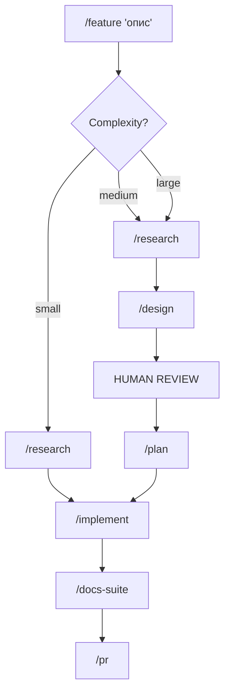

# Architecture

Анатомія репозиторію AMO Claude Workflows — повністю автономної системи розробки під Claude Code CLI.

## Призначення

Система перетворює одного розробника з Claude Code на повноцінну команду: дослідження, архітектура, реалізація, код-рев'ю, документація — все через визначені флоу з AI-агентами.

Репозиторій містить **тільки промпти та конфігурацію** — жодного runtime-коду. Все працює через Claude Code CLI, який читає ці файли як інструкції.

## Структура

```
amo-claude-workflows/
├── agents/               # Персони AI-агентів
│   ├── engineering/      # 16 агентів розробки
│   └── documentation/    # 5 агентів документації
├── commands/             # Slash-команди — точки входу
├── scenarios/            # Multi-agent workflows
│   └── delivery/         # Feature development, docs suite
├── rules/                # Domain rules (стиль коду, безпека, тести)
├── contexts/             # Mode contexts (dev, planning, research, review)
├── skills/               # Reusable skills та templates
├── templates/            # Шаблони для нових компонентів
├── docs/                 # Документація системи
│   ├── how/              # Як використовувати
│   ├── why/              # Чому саме так
│   └── comparisons/      # Порівняння підходів
├── plans/                # Плани розвитку
├── install.sh            # Symlink installer
├── uninstall.sh          # Symlink remover
├── CLAUDE.md             # Master index для Claude Code
└── README.md             # Опис проекту
```

## Компоненти

### Agents (`agents/`)

Markdown-файли з YAML frontmatter. Кожен агент — це персона з визначеними:
- **Bias** — головний пріоритет (наприклад, security-reviewer параноїдально шукає вразливості)
- **Consumes/Produces** — вхідні та вихідні артефакти
- **Model** — opus для лідів (reasoning), sonnet для виконавців (execution)

**Engineering** (16 агентів):

| Група | Агенти |
|-------|--------|
| Research | research-lead, codebase-researcher |
| Design | design-architect, test-strategist, devils-advocate |
| Planning | phase-planner |
| Implementation | implement-lead, code-writer, tdd-guide |
| Review | security-reviewer, quality-reviewer, design-reviewer, quality-gate |
| Operations | sentry-triager, qa-engineer, task-refiner |

**Documentation** (5 агентів):

| Агент | Роль |
|-------|------|
| technical-collector | Збір технічних фактів з коду |
| architect-collector | Генерація архітектурних діаграм |
| swagger-collector | OpenAPI spec генерація/валідація |
| technical-writer | Написання документації з артефактів |
| system-profiler | Реєстр інтеграцій системи |

### Commands (`commands/`)

Slash-команди — точки входу для користувача. Кожна команда:
1. Завантажує project skill (якщо є)
2. Активує відповідних агентів з rules та context
3. Оркеструє виконання та збір артефактів

Ключові команди: `/feature`, `/refine`, `/research`, `/design`, `/plan`, `/implement`, `/pr`, `/docs-suite`, `/sentry-triage`, `/qa-checklist`, `/system-profile`, `/skill-from-git`, `/ai-debug`.

### Scenarios (`scenarios/`)

Описи multi-agent workflows — хто, в якій послідовності, з якими артефактами працює. Сценарій — це "оркестр", команди — "диригент", агенти — "музиканти".

### Rules (`rules/`)

Domain-specific правила, які агенти завантажують за потребою:
- `coding-style.md` — PHP 8.3/Symfony 6.4 стандарти
- `security.md` — PII/PHI захист, OWASP
- `testing.md` — coverage targets, test patterns
- `database.md` — Doctrine, N+1, міграції
- `messaging.md` — RabbitMQ/Kafka, ідемпотентність
- `language.md` — українська для комунікації
- `git.md` — конвенції коммітів
- `qa-checklist-selection.md` — вибір pre-defined чеклістів (iOS/Android, API, A/B)

### Contexts (`contexts/`)

Mode-specific пріоритети та guardrails. Інжектяться в spawn-промпти агентів:
- `dev.md` — для Code Writer під час implementation
- `review.md` — для Security/Quality/Design Reviewers
- `research.md` — для Research Lead та scanners
- `planning.md` — для Phase Planner

### Skills (`skills/`)

Reusable knowledge packages — templates, checklists, reference materials:
- `design-template/` — формат architecture.md + diagrams.md
- `adr-template/` — Architecture Decision Records
- `owasp-top-10/` — вразливості та code patterns
- `security-audit-checklist/` — чеклист безпеки
- `tdd-approach/` — TDD секції для планів
- `test-design-techniques/` — EP, BVA, Decision Table та інші техніки
- `task-refinement/` — story formats, INVEST criteria
- `api-contracts-template/` — REST + async контракти
- `stoplight-docs/` — Stoplight API docs

## Головний флоу: Feature Development



**Адаптивна складність:**
- **Small** — skip Design+Plan, 1 reviewer → ~76% економія токенів
- **Medium** — light Design, 2 reviewers
- **Large** — повний флоу з усіма агентами

## Артефактний ланцюг

Ключовий принцип: кожен агент працює з **виходом попереднього агента**, а не з сирим кодом.

```
.workflows/{feature-name}/
├── research/       ← Research Lead output
├── design/         ← Design Architect + Test Strategist output
│   └── adr/        ← Architecture Decision Records
├── plan/           ← Phase Planner output
└── implement/      ← Code Writer + Reviewers output
```

## Механізм інсталяції

`install.sh` створює **symlinks** з цього репозиторію в `~/.claude/`:

```
amo-claude-workflows/commands/*  →  ~/.claude/commands/*
amo-claude-workflows/agents/*    →  ~/.claude/agents/*
amo-claude-workflows/rules/*     →  ~/.claude/rules/*
...
```

Кожен файл/піддиректорія лінкується окремо. Існуючі файли не перезаписуються. Це дозволяє мати кілька джерел у `~/.claude/` без конфліктів.

## Дизайн-рішення

| Рішення | Обґрунтування |
|---------|---------------|
| Промпти, не код | Система працює через Claude Code CLI — runtime не потрібен |
| Symlinks, не копіювання | Зміни в репо миттєво доступні в CLI |
| Opus для лідів, Sonnet для виконавців | Баланс між якістю reasoning та швидкістю execution |
| Technology-agnostic агенти | Один набір агентів працює з будь-яким стеком через tech profiles |
| Artifact chain | Кожен крок будує на попередньому — менше галюцинацій, більше consistency |
| Адаптивна складність | Економія ~76% токенів на простих задачах без втрати якості на складних |
