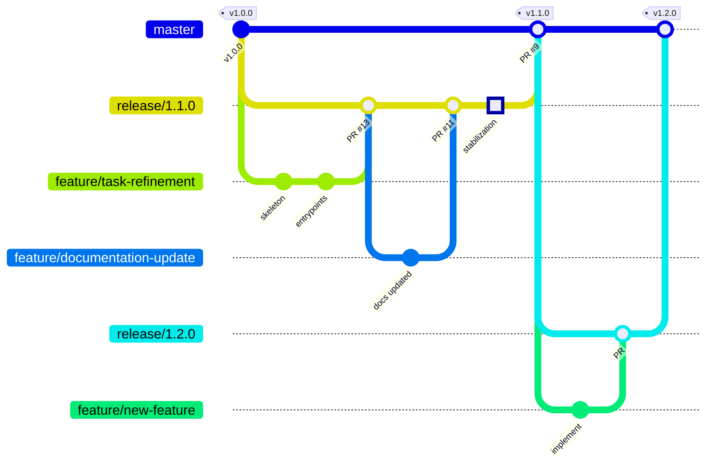

# Contributing

Дякуємо за інтерес до AMO Claude Workflows! Цей документ описує процес внесення змін та реліз-цикл проекту.

## Передумови

- [Claude Code CLI](https://claude.ai/code) встановлений (`~/.claude/` існує)
- Git 2.30+
- Базове розуміння Claude Code: commands, agents, skills

## Як зробити внесок

### 1. Створити feature branch

```bash
# Актуальна release гілка — release/1.x.0
git checkout release/1.x.0
git pull origin release/1.x.0
git checkout -b feature/назва-фічі
```

### 2. Внести зміни

Дотримуйтесь структури репозиторію (див. [ARCHITECTURE.md](ARCHITECTURE.md)):

| Що додаєте | Куди |
|------------|------|
| Новий агент | `agents/engineering/` або `agents/documentation/` |
| Нова команда | `commands/` |
| Новий skill | `skills/{name}/SKILL.md` |
| Нове правило | `rules/` |
| Документація | `docs/how/`, `docs/why/`, `docs/comparisons/` |

### 3. Документаційна дисципліна

Кожна зміна з окремим логічним циклом виконання **мусить** бути задокументована щонайменше в одній з:

- `docs/how/` — як це використовувати (покрокові гайди)
- `docs/why/` — чому зроблено саме так (обґрунтування рішень)
- `docs/comparisons/` — чим відрізняється від попереднього/альтернатив

### 4. Перевірка

- Запустіть `./install.sh` — переконайтесь, що symlinks створюються коректно
- Протестуйте змінені команди/агенти в реальному Claude Code сеансі
- Перевірте, що `CLAUDE.md` оновлений, якщо додано новий агент/команду/skill

### 5. Pull Request

```bash
git push origin feature/назва-фічі
```

Створіть PR в **поточну release гілку** (не в `master`).

PR має містити:
- Опис проблеми або потреби
- Що змінено та чому
- Як перевірити (кроки для тестування)

## Реліз-процес

### Branching Model

```
master (stable)
  └── release/1.x.0 (integration)
        └── feature/назва-фічі (робоча гілка)
```

### Цикл релізу



**Крок за кроком:**

1. **Створення release гілки** — від `master` створюється `release/1.x.0`
2. **Розробка** — feature branches створюються від release гілки
3. **Інтеграція** — feature branches мержаться в release через PR
4. **Стабілізація** — в release гілці фіксяться баги, проводиться QA
5. **Реліз** — release гілка мержиться в `master` через PR
6. **Тегування** — на `master` створюється тег `v1.x.0`

### Версіонування

Проект використовує [Semantic Versioning](https://semver.org/):

- **MAJOR** (v2.0.0) — breaking changes у структурі агентів/команд
- **MINOR** (v1.2.0) — нові агенти, команди, skills, сценарії
- **PATCH** (v1.1.1) — фікси, покращення існуючих компонентів

### Історія релізів

| Версія | Що увійшло |
|--------|-----------|
| v1.1.0 | Task refinement, system profiler, documentation improvements, QA engineer agent |
| v1.0.0 | Feature development flow, engineering agents, documentation suite, Sentry triage |
| v0.1.0 | Initial engineering workflow |

## Конвенції

### Назви гілок

| Тип | Патерн | Приклад |
|-----|--------|---------|
| Feature | `feature/опис` | `feature/task-refinement` |
| Fix | `fix/опис` | `fix/remove-old-files` |
| Release | `release/1.x.0` | `release/1.2.0` |

### Commit messages

- Англійською мовою
- Короткий, змістовний опис змін
- Без AI-атрибуції (Co-Authored-By тощо)

### Мова

- Код, ідентифікатори, commit messages — **англійська**
- PR описи, документація, коментарі — **українська**

## Принципи

1. **Інтеграція перед створенням** — перевір, чи існуючий агент/флоу покриває потребу, перш ніж створювати новий
2. **Артефактний ланцюг** — кожен агент працює з виходом попереднього, а не з сирим кодом
3. **Technology-agnostic** — агенти не прив'язані до конкретного стеку, використовують tech profiles
4. **Мінімальна складність** — не додавай те, що не потрібно прямо зараз
