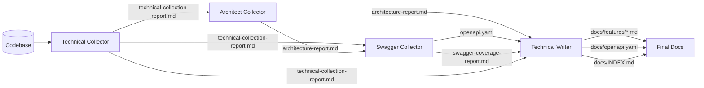
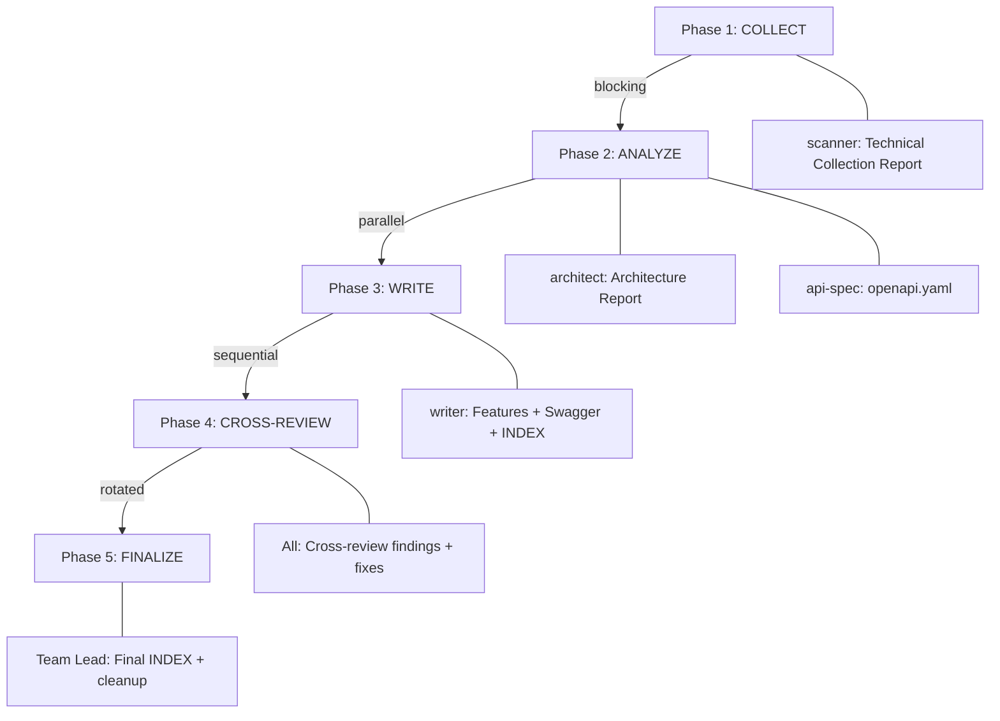
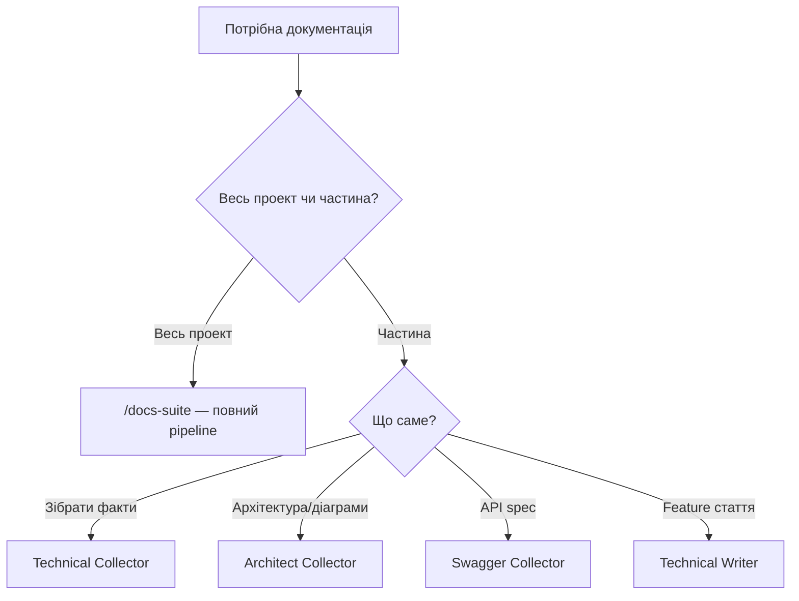

# Агенти документації та Documentation Suite

Чотири агенти для документації, об'єднані в один сценарій з оркестрацією через Agent Teams.

## Швидке порівняння

| Аспект | Technical Collector | Architect Collector | Swagger Collector | Technical Writer |
|--------|-------------------|--------------------|--------------------|-----------------|
| **Bias** | Facts over opinions | Diagram first | Code-driven | Audience first |
| **Фокус** | Збір фактів з коду | Архітектура, діаграми | OpenAPI специфікація | Feature-статті, збагачення |
| **Інструменти** | Read, Grep, Glob | Read, Grep, Glob, Write, Edit | Read, Grep, Glob, Write | Read, Grep, Glob, Write, Edit |
| **Режим** | `plan` (read-only) | `acceptEdits` | `acceptEdits` | `acceptEdits` |
| **Модель** | sonnet | sonnet | sonnet | sonnet |
| **maxTurns** | 30 | 40 | 40 | 50 |
| **memory** | project | project | project | project |

---

## Artifact Chain

Агенти працюють послідовно — кожен наступний використовує артефакти попереднього, а не сканує код напряму.



### Артефакти

| Файл | Хто створює | Хто споживає |
|------|-------------|--------------|
| `docs/.artifacts/technical-collection-report.md` | Technical Collector | Architect, Swagger, Writer |
| `docs/.artifacts/architecture-report.md` | Architect Collector | Swagger, Writer |
| `docs/.artifacts/openapi.yaml` | Swagger Collector | Writer |
| `docs/.artifacts/swagger-coverage-report.md` | Swagger Collector | Writer |
| `docs/features/*.md` | Technical Writer | Кінцевий результат |
| `docs/openapi.yaml` | Technical Writer | Кінцевий результат |
| `docs/INDEX.md` | Technical Writer | Кінцевий результат |

---

## Агенти

### Technical Collector

**Файл**: `agents/documentation/technical-collector.md`
**Motto**: "Only what IS, never what SHOULD BE."

Сканує codebase і збирає структуровані факти: компоненти, роути, ентіті, інтеграції, конфіг. Жодного аналізу, жодних рекомендацій.

**Автодетекція технологій:**

| Файл | Профіль |
|------|---------|
| `composer.json` + `symfony.lock` | PHP/Symfony |
| `package.json` + `next.config.*` | Node/Next.js |
| `package.json` + `nest-cli.json` | Node/NestJS |
| `go.mod` | Go |
| `Cargo.toml` | Rust |

**Output**: Technical Collection Report — таблиці компонентів, інтеграцій, конфігу, статистика.

---

### Architect Collector

**Файл**: `agents/documentation/architect-collector.md`
**Motto**: "Show the system, not the code."

Аналізує архітектуру на основі Technical Collector output. Створює C4 діаграми, sequence diagrams, ER diagrams, каталог інтеграцій.

**Обов'язкові секції:**
- C4 Context Diagram (Mermaid)
- Component Diagram (Mermaid)
- Key Flows (sequence/flowchart)
- Integration Catalog
- Open Questions (zero questions = не дивився уважно)

**Output**: Architecture Report з Mermaid діаграмами.

---

### Swagger Collector

**Файл**: `agents/documentation/swagger-collector.md`
**Motto**: "If it's not in the code, it's not in the spec."

Генерує OpenAPI 3.0 специфікацію з артефактів Technical Collector та Architect Collector. Descriptions залишає порожніми для Technical Writer.

**Ключові правила:**
- Кожен endpoint має tracing до реального коду
- Порожній description краще за неправильний
- `TODO` маркери для gaps — не вгадувати
- Schema з entities/DTOs, не вигадані

**Output**: `openapi.yaml` + Coverage Report з gaps.

---

### Technical Writer

**Файл**: `agents/documentation/technical-writer.md`
**Motto**: "Documentation is a product, not a byproduct."

Трансформує всі артефакти у читабельну документацію: feature-статті, збагачений Swagger, INDEX.

**Три задачі:**
1. **Feature Articles** — `docs/features/*.md` з flow diagrams, API references, data models
2. **Swagger Enrichment** — descriptions, examples, cross-links до feature articles (без зміни schema)
3. **Documentation Index** — `docs/INDEX.md` як єдина точка входу

**Skills**: `stoplight-docs` — Stoplight-compatible форматування.

---

## Documentation Suite — Сценарій

**Команда**: `/docs-suite`
**Сценарій**: `scenarios/delivery/documentation-suite.md`
**Вимога**: `CLAUDE_CODE_EXPERIMENTAL_AGENT_TEAMS=1`

### Оркестрація

Claude виступає **Team Lead** і координує 4 teammates через Agent Teams API:

```
TeamCreate → spawn teammates → shared task list → SendMessage → TeamDelete
```

| Роль | Teammate | Фази |
|------|----------|------|
| Team Lead (Claude) | — | Всі (оркестрація) |
| scanner | Technical Collector | Phase 1 |
| architect | Architect Collector | Phase 2A, 4 |
| api-spec | Swagger Collector | Phase 2B, 4 |
| writer | Technical Writer | Phase 3, 4 |

### 5 фаз



| Фаза | Тип | Що відбувається |
|------|-----|----------------|
| **1. COLLECT** | Blocking | scanner сканує codebase, створює Technical Collection Report |
| **2. ANALYZE** | Parallel | architect + api-spec працюють одночасно над різними артефактами |
| **3. WRITE** | Sequential | writer трансформує всі артефакти в документацію |
| **4. CROSS-REVIEW** | Rotated | Агенти перевіряють output один одного за review matrix |
| **5. FINALIZE** | Lead only | Перевірка посилань, оновлення INDEX, TeamDelete |

### Phase Gates

Між фазами Team Lead перевіряє якість:

| Gate | Перевірка |
|------|-----------|
| After Phase 1 | Components Summary має counts > 0 |
| After Phase 2 | Architecture report містить Mermaid diagram; openapi.yaml має `paths:` |
| After Phase 3 | Існує ≥1 feature article; існує `docs/INDEX.md` |
| After Phase 4 | Всі `high` severity issues вирішені |

### Cross-Review Matrix (Phase 4)

| Рев'юер | Перевіряє output | Фокус |
|---------|------------------|-------|
| Architect | Swagger Collector | Endpoint naming = architecture; integration flows в API |
| Architect | Technical Writer | Діаграми в статтях consistent з architecture docs |
| Swagger | Technical Writer | Descriptions match actual endpoint behavior |
| Writer | Architect | Mermaid syntax valid; Open Questions actionable |
| Writer | Swagger | Schema naming consistent; gaps justified |

### Комунікація

| Канал | Призначення |
|-------|-------------|
| **Shared task list** | Основна координація: pending → in_progress → completed |
| **SendMessage** | Task assignments, status updates, review findings, shutdown |
| **Artifacts on disk** | `docs/.artifacts/` — передача даних між фазами |
| **TeammateIdle** | Автоматичне сповіщення Team Lead коли teammate закінчив |

---

## Scope Options

```bash
/docs-suite                          # Повний suite (всі фази)
/docs-suite --scope architecture     # Тільки архітектура (Phase 1 + 2A)
/docs-suite --scope api              # Тільки API (Phase 1 + 2B + 3 swagger only)
/docs-suite --skip-review            # Без cross-review (Phase 1 → 2 → 3 → 5)
```

| Флаг | Фази | Teammates |
|------|------|-----------|
| (default) | 1 → 2 → 3 → 4 → 5 | Всі 4 |
| `--scope architecture` | 1 → 2A | scanner, architect |
| `--scope api` | 1 → 2B → 3 | scanner, api-spec, writer |
| `--skip-review` | 1 → 2 → 3 → 5 | Всі 4, без Phase 4 |

---

## Коли використовувати кожного агента окремо



| Потреба | Агент | Як запустити |
|---------|-------|-------------|
| Повна документація проекту | Всі 4 | `/docs-suite` |
| Тільки архітектура + діаграми | TC → AC | `/docs-suite --scope architecture` |
| Тільки API документація | TC → SC → TW | `/docs-suite --scope api` |
| Зібрати факти з codebase | Technical Collector | Прямий виклик агента |
| Оновити feature article | Technical Writer | Прямий виклик з артефактами |
| Перегенерувати Swagger | Swagger Collector | Прямий виклик з артефактами |

---

## Anti-Patterns

1. **Bypassing artifacts chain** — агент сканує код напряму замість Technical Collector output → inconsistent facts
2. **Skipping cross-review** — генерація в ізоляції → naming drift між architecture і API docs
3. **Over-generating** — документація кожного internal helper → шум замість сигналу
4. **Empty descriptions** — Swagger Collector генерує spec, ніхто не збагачує → unusable spec
5. **No diagrams** — architecture doc без Mermaid визуалів = просто текст
6. **Zero Open Questions** — architect не дивився уважно

---

## Success Criteria

### Minimum Viable
- [ ] Technical Collection Report з усіма типами компонентів
- [ ] Architecture doc з C4 Context Diagram
- [ ] `openapi.yaml` з усіма endpoints
- [ ] ≥1 feature article

### Good
- [ ] Architecture doc з C4 Context + Component + key flow diagrams
- [ ] `openapi.yaml` з descriptions та examples
- [ ] Feature articles для всіх major domains
- [ ] Валідні cross-references між docs

### Excellent
- [ ] Cross-review завершений, всі high issues вирішені
- [ ] ER diagram для data model
- [ ] Integration catalog complete
- [ ] `docs/INDEX.md` з повним каталогом
- [ ] Open Questions задокументовані
- [ ] Zero TODO gaps в Swagger

---

## Файлова структура

```
agents/documentation/
├── technical-collector.md     # Phase 1: збір фактів
├── architect-collector.md     # Phase 2A: архітектура + діаграми
├── swagger-collector.md       # Phase 2B: OpenAPI spec
└── technical-writer.md        # Phase 3: feature articles + enrichment

commands/
└── docs-suite.md              # Команда /docs-suite (Team Lead інструкції)

scenarios/delivery/
└── documentation-suite.md     # Сценарій (blueprint для оркестрації)

skills/stoplight-docs/
└── SKILL.md                   # Stoplight formatting skill (для Technical Writer)

docs/                          # Output directory
├── .artifacts/                # Проміжні артефакти (між агентами)
│   ├── technical-collection-report.md
│   ├── architecture-report.md
│   ├── openapi.yaml
│   └── swagger-coverage-report.md
├── features/                  # Feature articles (фінальні)
│   └── *.md
├── openapi.yaml               # Збагачений OpenAPI spec (фінальний)
└── INDEX.md                   # Єдина точка входу
```
