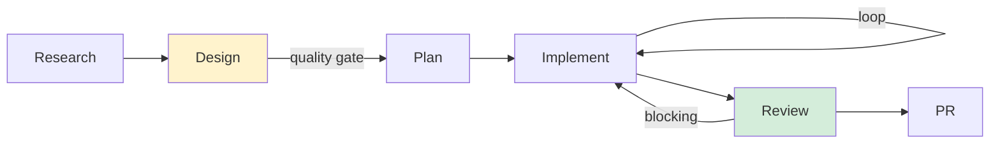
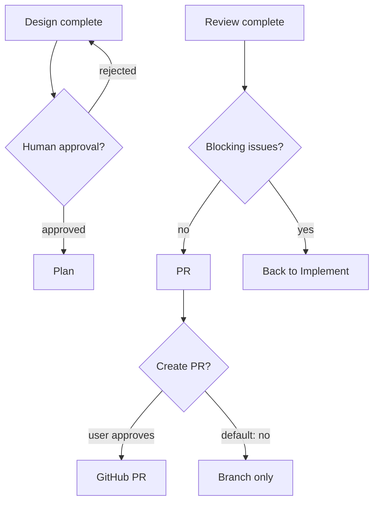

# /dev Workflow — Development Pipeline

6-кроковий pipeline для розробки фіч: від аналізу до PR.

## Flow



## Quick Start

```bash
# 1. Почати нову задачу
/dev "Add Apple Health integration"

# 2. Продовжити (auto-detect наступний крок)
/dev

# 3. Перевірити прогрес
/dev --status
```

## Steps

| # | Step | Execution | Agents | Output |
|---|------|-----------|--------|--------|
| 1 | **Research** | Agent Team | researcher + codebase-doc-collector + architecture-doc-collector | `.workflows/research/` |
| 2 | **Design** | Agent Team | architecture-advisor + technical-writer | `.workflows/design/` |
| 3 | **Plan** | Single | planner | `.workflows/plan/{name}/001-PLAN.md` |
| 4 | **Implement** | Agent Team | tdd-guide (developer) + code-reviewer (reviewer) | Code + `.workflows/implement/PROGRESS.md` |
| 5 | **Review** | Agent Team | code-reviewer + security-reviewer | `.workflows/review/{name}/REVIEW.md` |
| 6 | **PR** | Single (bash) | gh CLI | Branch + commits + `.workflows/pr/PR.md` |

## Step Details

### 1. Research — "Що є зараз?"

Збирає AS-IS інформацію про систему. Жодних пропозицій — тільки опис поточного стану.

**Team**: Lead декомпозує задачу → code-scanner аналізує код → arch-scanner аналізує архітектуру → Lead агрегує.

**Output**: 5 файлів (RESEARCH.md + code-analysis + data-model + architecture-analysis + test-coverage)

### 2. Design — "Як це має працювати?"

Технічний дизайн: C4/DataFlow/Sequence діаграми (Mermaid), ADR, API контракти.

**Quality gate**: Дизайн потрібно заапрувити перед продовженням.

### 3. Plan — "В якому порядку?"

Розбиває дизайн на фази. Кожна фаза незалежно deployable.

### 4. Implement — "Пишемо код"

Agent Team з developer + reviewer:
- developer пише код (TDD: тести → код → рефакторинг)
- reviewer перевіряє (security + quality + plan compliance)
- Внутрішня петля: reviewer повертає код → developer виправляє

### 5. Review — "Фінальна перевірка"

Комплексне ревю всього scope. Два паралельних треки: quality + security.

Може запускатися окремо: `/dev --step review`

### 6. PR — "Готово"

Створює гілку + коміти. **НЕ** створює PR автоматично — тільки після явного дозволу.

## Quality Gates



## Commands

| Command | Description |
|---------|-------------|
| `/dev "task"` | Start new workflow |
| `/dev` | Auto-continue next step |
| `/dev --step <name>` | Run specific step |
| `/dev --step implement --phase N` | Run specific phase |
| `/dev --status` | Show state |
| `/dev --reset` | Reset workflow |
| `/dev --auto` | Run all, pause at gates |

## Related

- **[Flow Diagrams](diagrams.md)** — Detailed Mermaid visualizations: pipeline, agent teams, artifact flow, internal loops, state machine
- [Artifacts spec](artifacts.md) — format of each artifact file
- [State management](state-management.md) — state.json, auto-continue, loops
- [Command reference](../../commands/dev.md) — full /dev command docs
- [Scenarios](../../scenarios/dev-workflow/) — 6 scenario files
- [Researcher agent](../../agents/researcher.md) — Research Team Lead
