# /dev Workflow — Flow Diagrams

Візуалізація повного pipeline, Agent Teams, артефактів та зворотних петель.

---

## 1. Main Pipeline Overview

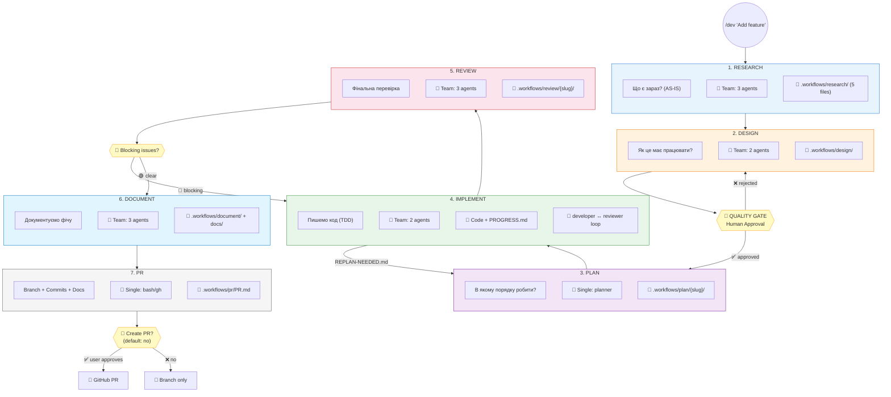

---

## 2. Agent Teams per Step

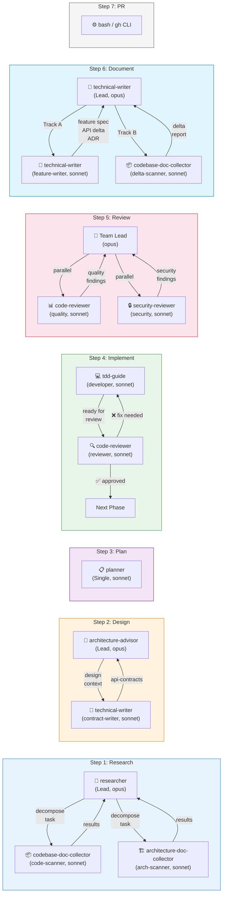

---

## 3. Artifact Flow Between Steps

```mermaid
flowchart LR
    subgraph RES_OUT["Research Output"]
        RES1["RESEARCH.md"]
        RES2["code-analysis.md"]
        RES3["data-model.md"]
        RES4["architecture-analysis.md"]
        RES5["test-coverage.md"]
    end

    subgraph DES_OUT["Design Output"]
        DES1["DESIGN.md"]
        DES2["diagrams.md"]
        DES3["api-contracts.md"]
        DES4["adr/*.md"]
    end

    subgraph PLN_OUT["Plan Output"]
        PLN1["001-PLAN.md"]
    end

    subgraph IMP_OUT["Implement Output"]
        IMP1["Code Files"]
        IMP2["PROGRESS.md"]
    end

    subgraph RVW_OUT["Review Output"]
        RVW1["REVIEW.md"]
    end

    subgraph DOC_OUT["Document Output"]
        DOC1["DOCS.md"]
        DOC2["feature-spec.md"]
        DOC3["api-changes.md"]
        DOC4["adr-updates.md"]
        DOC5["delta-report.md"]
    end

    subgraph PR_OUT["PR Output"]
        PR1["PR.md"]
        PR2["git branch"]
        PR3["git commits"]
    end

    RES_OUT -->|"input"| DES_OUT
    RES_OUT -->|"input"| PLN_OUT
    DES_OUT -->|"input"| PLN_OUT
    DES_OUT -->|"input"| IMP_OUT
    PLN_OUT -->|"input"| IMP_OUT
    DES_OUT -->|"compliance\ncheck"| RVW_OUT
    IMP_OUT -->|"code to\nreview"| RVW_OUT
    DES_OUT -->|"feature\noverview"| DOC_OUT
    IMP_OUT -->|"file list\n(scope)"| DOC_OUT
    RVW_OUT -->|"verdict"| DOC_OUT
    DOC_OUT -->|"docs for\nstaging"| PR_OUT
    RVW_OUT -->|"PR\ndescription"| PR_OUT
    DES_OUT -->|"summary"| PR_OUT
    PLN_OUT -->|"changes\nlist"| PR_OUT

    style RES_OUT fill:#e8f4fd,stroke:#1976d2
    style DES_OUT fill:#fff3e0,stroke:#f57c00
    style PLN_OUT fill:#f3e5f5,stroke:#7b1fa2
    style IMP_OUT fill:#e8f5e9,stroke:#388e3c
    style RVW_OUT fill:#fce4ec,stroke:#c62828
    style DOC_OUT fill:#e1f5fe,stroke:#0277bd
    style PR_OUT fill:#f5f5f5,stroke:#616161
```

---

## 4. Step Internal Flows

### 4.1 Research — 3 Phases

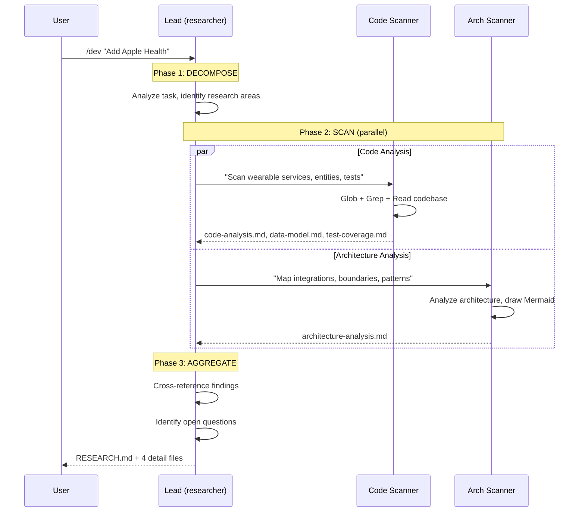

### 4.2 Design — 4 Phases

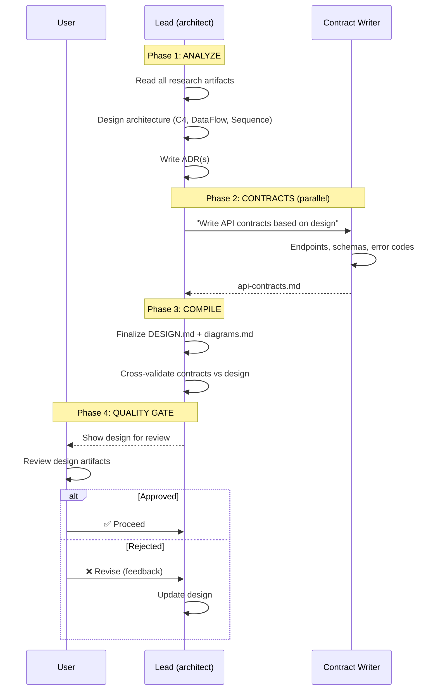

### 4.3 Plan — 3 Phases

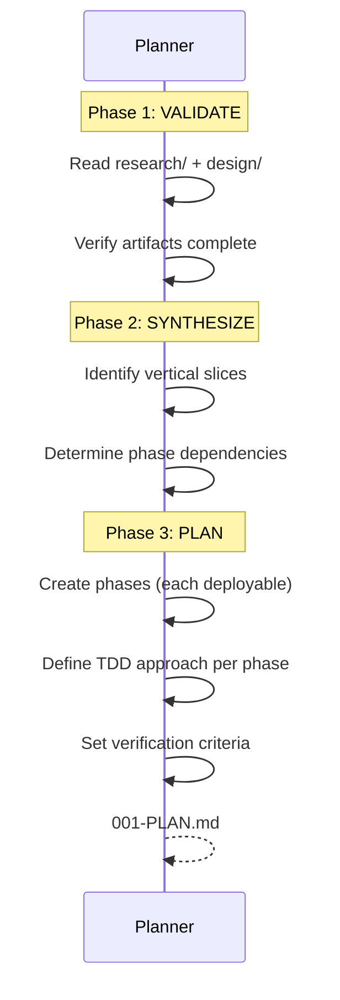

### 4.4 Implement — Internal Loop (per Phase)

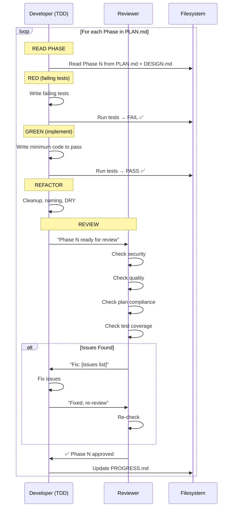

### 4.5 Review — 2 Phases

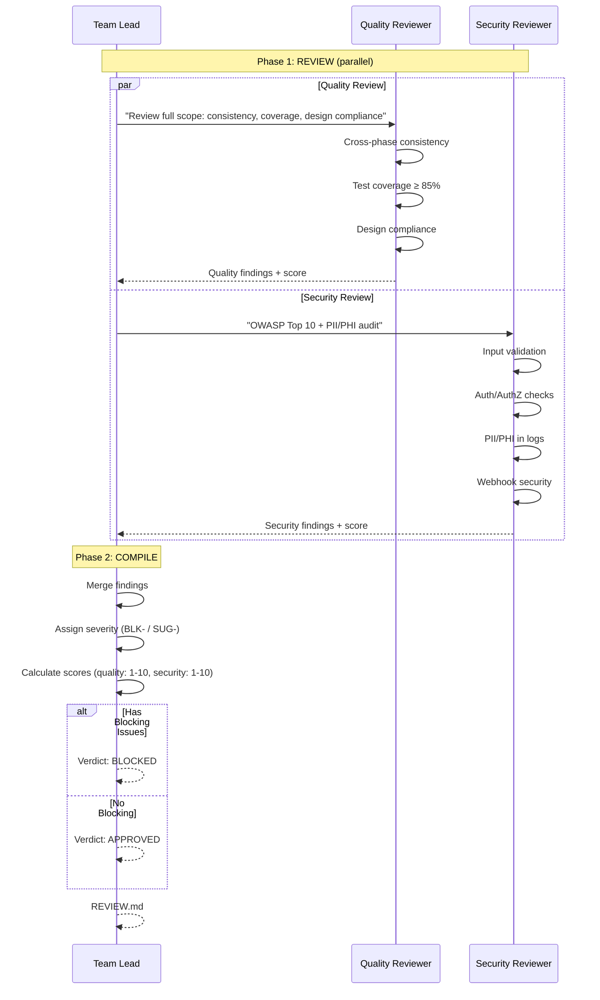

### 4.6 Document — 3 Phases

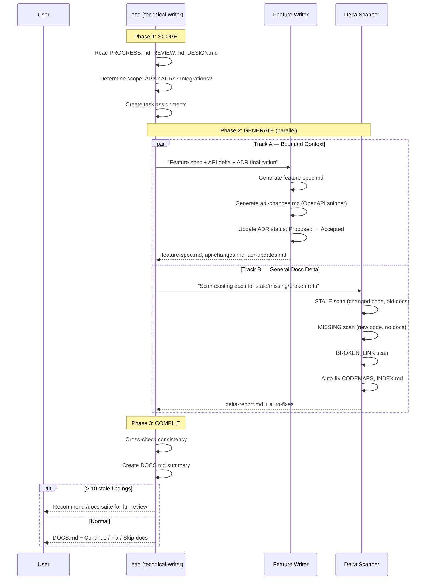

### 4.7 PR — 5 Phases

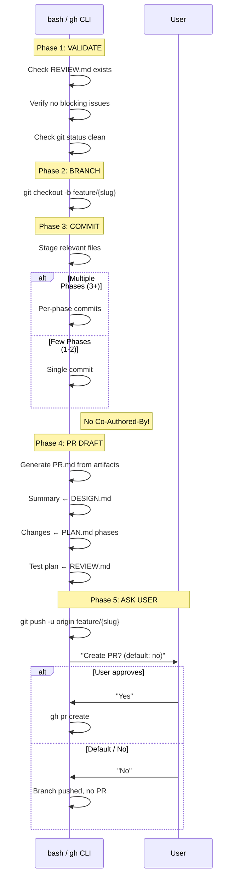

---

## 5. Feedback Loops

```mermaid
flowchart TB
    subgraph MAIN["Main Pipeline"]
        R["1. Research"] --> D["2. Design"]
        D --> P["3. Plan"]
        P --> I["4. Implement"]
        I --> REV["5. Review"]
        REV --> DOC["6. Document"]
        DOC --> PR["7. PR"]
    end

    subgraph LOOPS["Feedback Loops"]
        direction TB

        L1["🔄 Design Rejection\nQuality Gate → back to Design"]
        L2["🔄 REPLAN\nImplement → back to Plan\n(REPLAN-NEEDED.md)"]
        L3["🔄 Blocking Issues\nReview → back to Implement"]
        L4["🔄 Internal Review\ndeveloper ↔ reviewer\n(within Implement)"]
        L5["🔄 CODE-ISSUE\nDocument → user decides\n(CODE-ISSUE.md)"]
    end

    D -.->|"❌ rejected"| D
    I -.->|"REPLAN-NEEDED.md"| P
    REV -.->|"🔴 blocking"| I
    I -.->|"🔍 review loop"| I
    DOC -.->|"CODE-ISSUE.md"| I

    style MAIN fill:#f9f9f9,stroke:#333
    style LOOPS fill:#fff9c4,stroke:#f9a825
    style L1 fill:#fff3e0
    style L2 fill:#f3e5f5
    style L3 fill:#fce4ec
    style L4 fill:#e8f5e9
    style L5 fill:#e1f5fe
```

---

## 6. State Machine

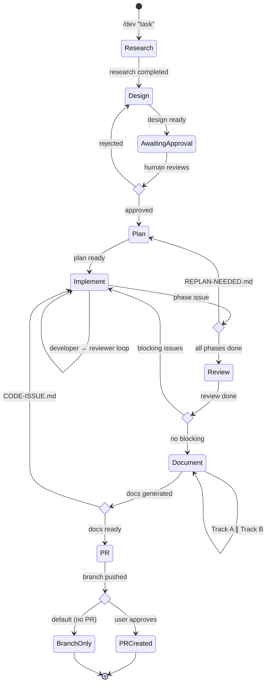

---

## 7. Complete Pipeline — Detailed View

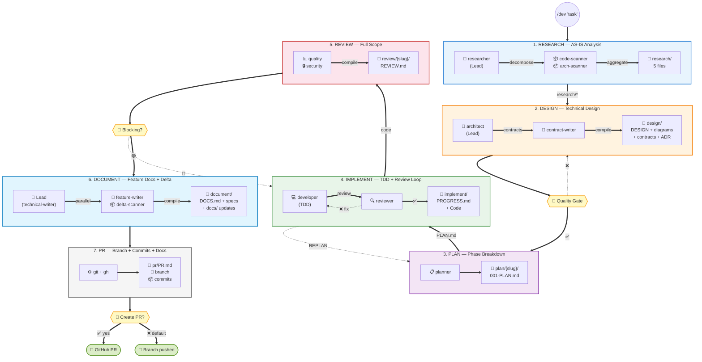

---

## 8. `/dev --status` View

Visual representation of the status table that `/dev --status` outputs:

```
┌────────────┬────────────┬───────────────┬────────────────────────────────┐
│   Step     │   Status   │   Agents      │   Output                       │
├────────────┼────────────┼───────────────┼────────────────────────────────┤
│ Research   │ ✅ done    │ 3 agents      │ .workflows/research/ (5 files) │
│ Design     │ ✅ done    │ 2 agents      │ .workflows/design/ (4+ files)  │
│ Plan       │ ✅ done    │ 1 agent       │ .workflows/plan/{slug}/        │
│ Implement  │ 🔄 3/4    │ 2 agents      │ Code + PROGRESS.md             │
│ Review     │ ⏳ pending │ 3 agents      │ —                              │
│ Document   │ ⏳ pending │ 3 agents      │ —                              │
│ PR         │ ⏳ pending │ bash/gh       │ —                              │
└────────────┴────────────┴───────────────┴────────────────────────────────┘
```

---

## 9. Agent Reuse Map

Shows how existing agents are reused across steps:

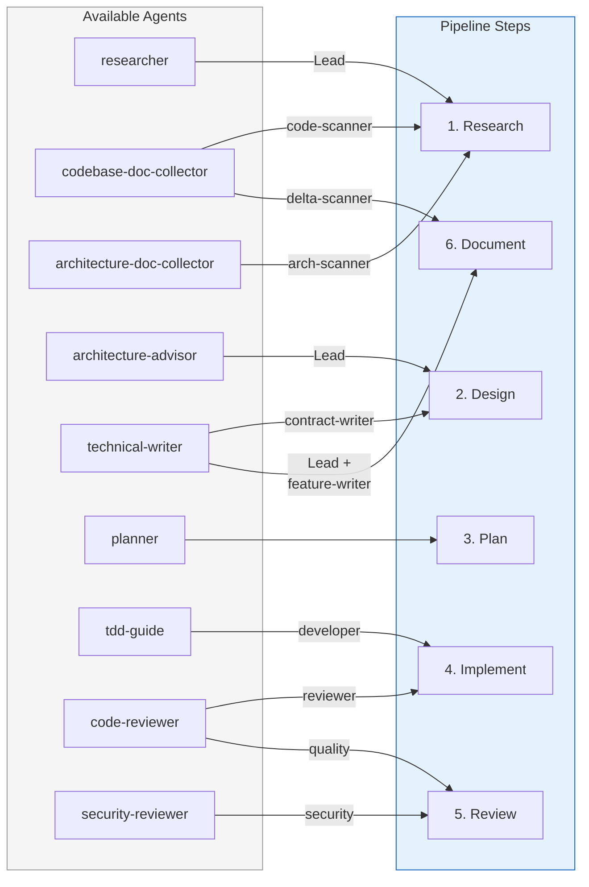

---

## Related

- [README](README.md) — Overview, quick start
- [Artifacts spec](artifacts.md) — File format details
- [State management](state-management.md) — state.json, auto-continue
