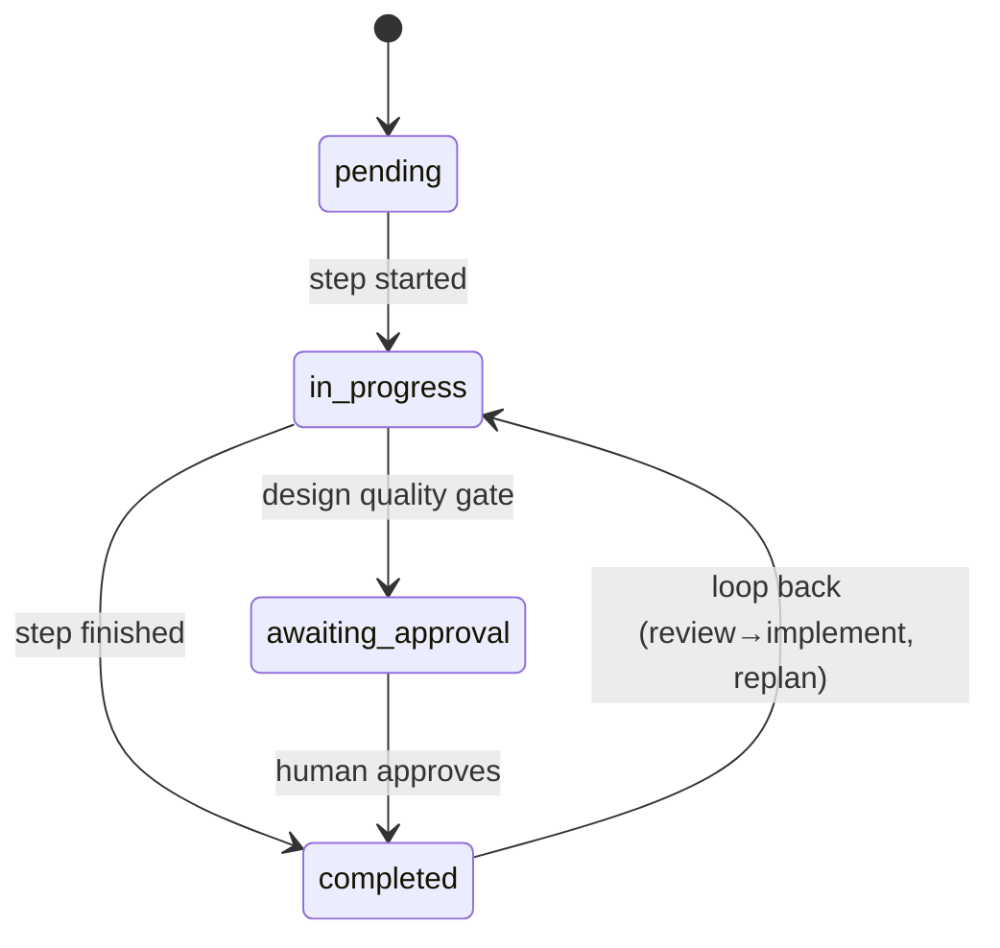

# /dev Workflow — State Management

## state.json Schema

```json
{
  "version": "1.0",
  "task": "Add Apple Health integration",
  "feature_slug": "apple-health-integration",
  "created_at": "2026-02-27T10:00:00Z",
  "current_step": "implement",
  "steps": {
    "research": {
      "status": "completed",
      "started_at": "2026-02-27T10:00:00Z",
      "completed_at": "2026-02-27T10:25:00Z",
      "artifacts": [
        ".workflows/research/RESEARCH.md",
        ".workflows/research/code-analysis.md",
        ".workflows/research/data-model.md",
        ".workflows/research/architecture-analysis.md",
        ".workflows/research/test-coverage.md"
      ]
    },
    "design": {
      "status": "completed",
      "started_at": "2026-02-27T10:30:00Z",
      "completed_at": "2026-02-27T11:15:00Z",
      "quality_gate": "approved",
      "artifacts": [
        ".workflows/design/DESIGN.md",
        ".workflows/design/diagrams.md",
        ".workflows/design/api-contracts.md",
        ".workflows/design/adr/001-adapter-pattern.md"
      ]
    },
    "plan": {
      "status": "completed",
      "started_at": "2026-02-27T11:20:00Z",
      "completed_at": "2026-02-27T11:35:00Z",
      "artifacts": [
        ".workflows/plan/apple-health-integration/001-PLAN.md"
      ]
    },
    "implement": {
      "status": "in_progress",
      "started_at": "2026-02-27T11:40:00Z",
      "phases_total": 4,
      "phases_completed": 2,
      "current_phase": 3
    },
    "review": {
      "status": "pending"
    },
    "pr": {
      "status": "pending"
    }
  }
}
```

## Status Values

| Status | Meaning |
|--------|---------|
| `pending` | Not started |
| `in_progress` | Currently running |
| `completed` | Finished successfully |
| `awaiting_approval` | Design quality gate — waiting for human |

## Status Transitions



## Auto-Continue Algorithm

When user runs `/dev` without flags:

```
1. Read .workflows/state.json
   - If file not found → error: "No active workflow. Run /dev <task> first."

2. Check for .workflows/implement/REPLAN-NEEDED.md
   - If exists → delete file, set plan.status = "pending", run Plan step

3. Find current_step (first step with status != "completed")
   - If all completed → report: "Workflow complete."

4. Check quality gates:
   - If design.status == "awaiting_approval" → show design, wait
   - If review has blocking issues → redirect to implement

5. Validate input artifacts exist for current step
   - If missing → error: "Required artifacts missing for {step}"

6. Run current step's scenario

7. Update state.json on completion

8. If --auto flag:
   - If next step has quality gate → STOP
   - Else → continue to next step
```

## Quality Gates

### Design Approval (Step 2 → Step 3)

```
After Design completes:
  state.json: design.status = "awaiting_approval"
  state.json: design.quality_gate = "awaiting_approval"

User reviews design artifacts.

When user runs /dev or /dev --step plan:
  state.json: design.status = "completed"
  state.json: design.quality_gate = "approved"
  Continue to Plan step
```

### Review Blocking (Step 5 → Step 4 loop)

```
After Review completes:
  Parse REVIEW.md for "Blocking Issues" section

If blocking issues found:
  state.json: review.status = "completed"
  state.json: review.has_blocking = true
  Next /dev redirects to Implement step

If no blocking issues:
  state.json: review.status = "completed"
  state.json: review.has_blocking = false
  Continue to PR step
```

### PR Creation (Step 6)

```
PR step creates branch + commits automatically.
PR creation requires explicit user approval:
  - Ask: "Create PR? (default: no)"
  - Only create if user says yes
  - No Co-Authored-By in commits
```

## Loop-Back Handling

### Implement → Plan (REPLAN)

```
During Implement, developer discovers PLAN.md infeasible:
  → Creates .workflows/implement/REPLAN-NEEDED.md
  → Next /dev detects this file
  → Deletes REPLAN-NEEDED.md
  → Resets plan.status = "pending"
  → Runs Plan step (produces new version: 002-PLAN.md)
```

### Review → Implement (Blocking)

```
Review finds blocking issues:
  → REVIEW.md contains blocking section
  → state.json: review.has_blocking = true
  → Next /dev detects blocking
  → Resets implement.status = "in_progress"
  → Developer fixes issues
  → Re-run review
```

## Reset Behavior

`/dev --reset`:

```
1. Delete .workflows/ directory completely
2. Report: "Workflow reset. Run /dev <task> to start a new one."
```

## Feature Slug Generation

```
Task: "Add Apple Health integration"
  → Remove articles: "Add Apple Health integration"
  → Lowercase: "add apple health integration"
  → Kebab-case: "add-apple-health-integration"
  → Max 5 words: "apple-health-integration" (remove verb "add")
  → Slug: apple-health-integration
```

Used in:
- `.workflows/plan/{slug}/001-PLAN.md`
- `.workflows/review/{slug}/REVIEW.md`
- Git branch: `feature/{slug}`
