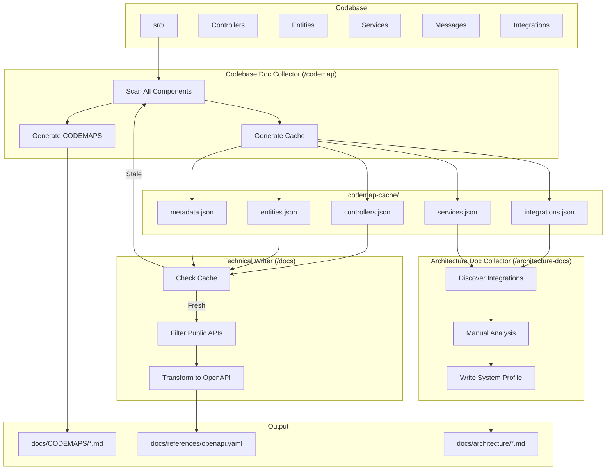

# Documentation Agents: Cooperation Protocol

Протокол кооперації між агентами документації для усунення дублювання та забезпечення data handoff.

**Учасники:**
- **Codebase Doc Collector** — Scanner, Cache Producer
- **Technical Writer** — Cache Consumer, OpenAPI Generator (high automation)
- **Architecture Doc Collector** — Cache Consumer, Integration Discovery (low automation)

---

## Проблема

Обидва агенти незалежно сканують однакові частини codebase:

```
┌─────────────────────────────────────────────────────────────────┐
│                     ПОТОЧНИЙ СТАН (Ізольовано)                   │
├─────────────────────────────────────────────────────────────────┤
│                                                                  │
│   Codebase Doc Collector                        Technical Writer            │
│   ┌─────────────┐                    ┌─────────────┐            │
│   │ Scan        │                    │ Scan        │            │
│   │ Controllers │ ──────────────────▶│ Controllers │            │
│   │ Entities    │                    │ DTOs        │            │
│   │ Services    │                    │ Entities    │            │
│   │ Messages    │                    │             │            │
│   └──────┬──────┘                    └──────┬──────┘            │
│          │                                  │                    │
│          ▼                                  ▼                    │
│   docs/CODEMAPS/*.md              docs/references/openapi.yaml  │
│   (Developer-facing)               (Stoplight-facing)           │
│                                                                  │
│   ❌ Duplicate scanning                                          │
│   ❌ No data sharing                                             │
│   ❌ Inconsistent results                                        │
└─────────────────────────────────────────────────────────────────┘
```

---

## Рішення: Pipeline з Intermediate Cache

```
┌─────────────────────────────────────────────────────────────────┐
│                    НОВИЙ СТАН (Кооперація)                       │
├─────────────────────────────────────────────────────────────────┤
│                                                                  │
│   ┌─────────────┐     ┌─────────────┐     ┌─────────────┐       │
│   │   Codebase  │────▶│ Codebase Doc Collector │────▶│ Cache (JSON)│       │
│   │             │     │  (Scanner)  │     │  .codemap-  │       │
│   │ src/        │     └──────┬──────┘     │   cache/    │       │
│   │ ├─Controller│            │            └──────┬──────┘       │
│   │ ├─Entity    │            │                   │              │
│   │ ├─Service   │            ▼                   ├──────────┐   │
│   │ ├─Message   │     docs/CODEMAPS/             │          │   │
│   │ └─Integration     (Markdown)                 ▼          ▼   │
│   └─────────────┘                    ┌───────────────┐ ┌────────┐
│                                      │  Technical    │ │ Arch   │
│                                      │    Writer     │ │  Doc   │
│                                      │  (Formatter)  │ │(Disco- │
│                                      └───────┬───────┘ │ very)  │
│                                              │         └───┬────┘
│                                              ▼             ▼     │
│                                      docs/references/  docs/arch/│
│                                      openapi.yaml      *.md     │
│                                                                  │
│   ✅ Single scan (Codebase Doc Collector)                                  │
│   ✅ Data handoff via cache                                     │
│   ✅ Consistent source of truth                                 │
└─────────────────────────────────────────────────────────────────┘
```

---

## Intermediate Cache Format

### Структура директорії

```
.codemap-cache/
├── metadata.json          # Cache info, timestamps
├── controllers.json       # Routes, methods, DTOs, auth
├── entities.json          # Properties, relations, constraints
├── services.json          # Dependencies, public methods
├── messages.json          # Handlers, message types, async
└── integrations.json      # External API calls, webhooks
```

### Consumer Matrix

| Cache File | Technical Writer | Architecture Doc Collector |
|------------|------------------|-------------------------|
| `controllers.json` | OpenAPI paths | — |
| `entities.json` | OpenAPI schemas | Data model diagrams |
| `services.json` | — | Architecture diagrams |
| `messages.json` | Async API docs | Async integration list |
| `integrations.json` | — | Integration catalog |

### metadata.json

```json
{
  "version": "1.0",
  "generated_at": "2024-01-15T10:30:00Z",
  "generated_by": "codebase-doc-collector",
  "project_root": "/path/to/project",
  "php_version": "8.3",
  "symfony_version": "6.4",
  "stats": {
    "controllers": 15,
    "entities": 18,
    "services": 23,
    "messages": 8
  },
  "cache_valid_until": "2024-01-22T10:30:00Z"
}
```

### controllers.json

```json
{
  "controllers": [
    {
      "class": "App\\Controller\\Api\\WorkoutController",
      "file": "src/Controller/Api/WorkoutController.php",
      "routes": [
        {
          "path": "/api/v1/workouts",
          "methods": ["GET", "POST"],
          "name": "workout_list_create",
          "action": "listAndCreate",
          "auth": {
            "required": true,
            "roles": ["ROLE_USER"],
            "scopes": ["workout:read", "workout:write"]
          },
          "request_dto": "App\\DTO\\CreateWorkoutRequest",
          "response_dto": "App\\DTO\\WorkoutResponse",
          "validations": [
            {
              "field": "name",
              "constraints": ["NotBlank", "Length(max=255)"]
            },
            {
              "field": "duration",
              "constraints": ["Positive"]
            }
          ]
        }
      ],
      "dependencies": [
        "WorkoutService",
        "WorkoutRepository"
      ]
    }
  ]
}
```

### entities.json

```json
{
  "entities": [
    {
      "class": "App\\Entity\\Workout",
      "file": "src/Entity/Workout.php",
      "table": "workouts",
      "properties": [
        {
          "name": "id",
          "type": "uuid",
          "primary": true,
          "generated": true
        },
        {
          "name": "name",
          "type": "string",
          "length": 255,
          "nullable": false
        },
        {
          "name": "duration",
          "type": "integer",
          "nullable": false
        }
      ],
      "relations": [
        {
          "name": "exercises",
          "type": "OneToMany",
          "target": "App\\Entity\\Exercise",
          "mappedBy": "workout",
          "cascade": ["persist", "remove"]
        },
        {
          "name": "user",
          "type": "ManyToOne",
          "target": "App\\Entity\\User",
          "inversedBy": "workouts"
        }
      ],
      "indexes": [
        {
          "name": "idx_workout_user",
          "columns": ["user_id", "created_at"]
        }
      ]
    }
  ]
}
```

### services.json

```json
{
  "services": [
    {
      "class": "App\\Service\\WorkoutService",
      "file": "src/Service/WorkoutService.php",
      "dependencies": [
        {
          "name": "repository",
          "type": "App\\Repository\\WorkoutRepository"
        },
        {
          "name": "dispatcher",
          "type": "Symfony\\Component\\EventDispatcher\\EventDispatcherInterface"
        }
      ],
      "public_methods": [
        {
          "name": "createWorkout",
          "params": ["CreateWorkoutRequest $request"],
          "return": "Workout",
          "throws": ["ValidationException"]
        },
        {
          "name": "completeWorkout",
          "params": ["Workout $workout"],
          "return": "void",
          "dispatches": ["WorkoutCompletedEvent"]
        }
      ]
    }
  ]
}
```

### messages.json

```json
{
  "handlers": [
    {
      "class": "App\\MessageHandler\\SyncWorkoutHandler",
      "file": "src/MessageHandler/SyncWorkoutHandler.php",
      "message": "App\\Message\\SyncWorkoutMessage",
      "async": true,
      "transport": "async",
      "retries": {
        "max_retries": 3,
        "delay": 1000,
        "multiplier": 2
      },
      "dependencies": [
        "WorkoutSyncService",
        "LoggerInterface"
      ],
      "idempotent": true,
      "idempotency_key": "externalId"
    }
  ],
  "messages": [
    {
      "class": "App\\Message\\SyncWorkoutMessage",
      "file": "src/Message/SyncWorkoutMessage.php",
      "properties": [
        {"name": "userId", "type": "string"},
        {"name": "externalId", "type": "string"},
        {"name": "source", "type": "string"}
      ]
    }
  ]
}
```

### integrations.json

```json
{
  "integrations": [
    {
      "name": "Apple App Store",
      "type": "http",
      "client_class": "App\\Client\\AppleStoreClient",
      "file": "src/Client/AppleStoreClient.php",
      "base_url_env": "APPLE_STORE_API_URL",
      "endpoints_used": [
        {"method": "POST", "path": "/verifyReceipt"},
        {"method": "GET", "path": "/subscriptions/{id}"}
      ],
      "auth": "jwt",
      "criticality": "critical"
    },
    {
      "name": "Amplitude",
      "type": "http",
      "client_class": "App\\Client\\AmplitudeClient",
      "file": "src/Client/AmplitudeClient.php",
      "base_url_env": "AMPLITUDE_API_URL",
      "endpoints_used": [
        {"method": "POST", "path": "/track"}
      ],
      "auth": "api_key",
      "criticality": "high"
    },
    {
      "name": "Subscription Webhooks",
      "type": "webhook",
      "controller": "App\\Controller\\Webhook\\SubscriptionWebhookController",
      "file": "src/Controller/Webhook/SubscriptionWebhookController.php",
      "routes": [
        {"path": "/webhook/apple", "methods": ["POST"]},
        {"path": "/webhook/google", "methods": ["POST"]}
      ],
      "criticality": "critical"
    }
  ],
  "kafka_topics": [
    {
      "topic": "wellness.events",
      "direction": "publish",
      "events": ["WorkoutCompleted", "SubscriptionChanged"]
    }
  ]
}
```

---

## Agent Responsibilities

### Codebase Doc Collector: Scanner + Cache Producer

```
┌────────────────────────────────────────────────────────────────┐
│ Codebase Doc Collector Responsibilities                                   │
├────────────────────────────────────────────────────────────────┤
│                                                                │
│ SCAN:                                                          │
│   ├─ Controllers (ALL, including internal)                     │
│   ├─ Entities (ALL relations, indexes)                         │
│   ├─ Services (ALL dependencies)                               │
│   ├─ Message Handlers (async config, retries)                  │
│   └─ Console Commands                                          │
│                                                                │
│ PRODUCE:                                                       │
│   ├─ .codemap-cache/*.json (structured data for other agents)  │
│   └─ docs/CODEMAPS/*.md (human-readable for developers)        │
│                                                                │
│ VALIDATE:                                                      │
│   ├─ Cache freshness (< 7 days)                                │
│   ├─ Files exist vs documented                                 │
│   └─ Cross-references valid                                    │
│                                                                │
└────────────────────────────────────────────────────────────────┘
```

### Technical Writer: Cache Consumer + Formatter

```
┌────────────────────────────────────────────────────────────────┐
│ Technical Writer Responsibilities                              │
├────────────────────────────────────────────────────────────────┤
│                                                                │
│ CONSUME (preferred):                                           │
│   ├─ .codemap-cache/controllers.json → OpenAPI paths           │
│   ├─ .codemap-cache/entities.json → OpenAPI schemas            │
│   └─ .codemap-cache/metadata.json → verify freshness           │
│                                                                │
│ FALLBACK (if cache missing/stale):                             │
│   └─ Direct code scan (existing behavior)                      │
│                                                                │
│ PRODUCE:                                                       │
│   ├─ docs/references/openapi.yaml (API spec)                   │
│   ├─ docs/references/schemas/*.yaml (reusable schemas)         │
│   ├─ docs/features/*.md (feature specs)                        │
│   ├─ docs/adr/*.md (ADRs)                                      │
│   └─ docs/runbooks/*.md (operational docs)                     │
│                                                                │
│ FILTER (from cache):                                           │
│   ├─ Only public API routes (skip internal)                    │
│   ├─ Only documented DTOs (skip internal)                      │
│   └─ Audience-appropriate content                              │
│                                                                │
│ AUTOMATION LEVEL: HIGH (cache → output with minimal input)     │
│                                                                │
└────────────────────────────────────────────────────────────────┘
```

### Architecture Doc Collector: Cache Consumer + Discovery

```
┌────────────────────────────────────────────────────────────────┐
│ Architecture Doc Collector Responsibilities                       │
├────────────────────────────────────────────────────────────────┤
│                                                                │
│ CONSUME (for discovery):                                       │
│   ├─ .codemap-cache/integrations.json → find external APIs     │
│   ├─ .codemap-cache/services.json → architecture diagrams      │
│   ├─ .codemap-cache/entities.json → data model overview        │
│   └─ .codemap-cache/messages.json → async integrations         │
│                                                                │
│ MANUAL ANALYSIS REQUIRED:                                      │
│   ├─ Business context (actors, use cases)                      │
│   ├─ Open Questions identification                             │
│   ├─ Criticality assessment                                    │
│   └─ High-level architectural decisions                        │
│                                                                │
│ PRODUCE:                                                       │
│   ├─ docs/architecture/system-profile.md                       │
│   └─ docs/architecture/integrations/*.md                       │
│                                                                │
│ AUTOMATION LEVEL: LOW (cache assists discovery, not output)    │
│                                                                │
└────────────────────────────────────────────────────────────────┘
```

### Comparison: Automation Levels

| Agent | Cache Usage | Automation | Human Input |
|-------|-------------|------------|-------------|
| Technical Writer | Full transformation | **High** | Minimal |
| Architecture Doc Collector | Discovery only | **Low** | Business context, actors, use cases |

---

## Workflow: Команди та Handoff

### Повний Pipeline

```
┌─────────────────────────────────────────────────────────────────┐
│                      Recommended Workflow                        │
├─────────────────────────────────────────────────────────────────┤
│                                                                  │
│  1. /codemap                                                     │
│     │                                                            │
│     ├─▶ Scan codebase                                            │
│     ├─▶ Generate .codemap-cache/*.json                           │
│     └─▶ Generate docs/CODEMAPS/*.md                              │
│                                                                  │
│  2. /docs --api                                                  │
│     │                                                            │
│     ├─▶ Read .codemap-cache/controllers.json                     │
│     │   (if fresh, use cache; if stale, warn + scan)             │
│     ├─▶ Filter: only public API routes                           │
│     ├─▶ Transform: JSON → OpenAPI YAML                           │
│     └─▶ Write docs/references/openapi.yaml                       │
│                                                                  │
│  3. /codemap --validate                                          │
│     │                                                            │
│     └─▶ Verify cache + codemaps + OpenAPI all in sync            │
│                                                                  │
└─────────────────────────────────────────────────────────────────┘
```

### Command Flags

| Command | Flag | Behavior |
|---------|------|----------|
| `/codemap` | (default) | Full scan, regenerate cache + CODEMAPS |
| `/codemap` | `--cache-only` | Only regenerate cache, skip CODEMAPS |
| `/codemap` | `--validate` | Check cache freshness + code sync |
| `/docs --api` | (default) | Use cache if fresh, else scan |
| `/docs --api` | `--no-cache` | Force direct code scan |
| `/docs --api` | `--from-cache` | Require cache, fail if missing |

---

## Cache Freshness Policy

```
┌─────────────────────────────────────────────────────────────────┐
│                     Cache Validity Rules                         │
├─────────────────────────────────────────────────────────────────┤
│                                                                  │
│  Cache Age        │ Status    │ Action                           │
│  ─────────────────┼───────────┼────────────────────────────────  │
│  < 7 days         │ Fresh     │ Use cache                        │
│  7-14 days        │ Stale     │ Warn + use cache                 │
│  > 14 days        │ Expired   │ Warn + force rescan              │
│  Missing          │ N/A       │ Run /codemap first               │
│                                                                  │
│  Invalidation Triggers:                                          │
│  ─────────────────────────────────────────────────────────────── │
│  • src/Controller/ modified                                      │
│  • src/Entity/ modified                                          │
│  • composer.json dependencies changed                            │
│  • Manual: /codemap --force                                      │
│                                                                  │
└─────────────────────────────────────────────────────────────────┘
```

---

## Integration Flow Diagram



---

## Error Handling

### Cache Missing

```
⚠️ .codemap-cache/ not found

Technical Writer needs cache data from Codebase Doc Collector.

Run first:
  /codemap

Then retry:
  /docs --api
```

### Cache Stale

```
⚠️ Cache is 10 days old (threshold: 7 days)

Options:
1. Use stale cache anyway:     /docs --api --from-cache
2. Regenerate cache first:     /codemap && /docs --api
3. Scan directly (slow):       /docs --api --no-cache
```

### Cache + Code Mismatch

```
❌ Cache validation failed

Differences found:
  + src/Controller/Api/NewController.php (in code, not in cache)
  - src/Controller/Api/OldController.php (in cache, deleted from code)

Run:
  /codemap

To regenerate cache and CODEMAPS.
```

---

## .gitignore Configuration

```gitignore
# Codebase Doc Collector cache (regenerated, not committed)
.codemap-cache/

# But commit the CODEMAPS (human-readable docs)
!docs/CODEMAPS/
```

---

## Див. також

- [Documentation Agents Comparison](./doc-agents-comparison.md)
- [Codebase Doc Collector Agent](../../agents/codebase-doc-collector.md)
- [Technical Writer Agent](../../agents/technical-writer.md)
- [Architecture Doc Collector Agent](../../agents/architecture-doc-collector.md)
- [CI/CD Automation](../../examples/automation/docs/cicd-example.md)
