# Documentation Suite vs Individual Commands

Порівняння `/docs-suite` (координована команда з 3 агентів) vs послідовний запуск `/codemap` + `/architecture-docs` + `/docs`.

---

## Проблема

Три окремі команди генерують документацію ізольовано:

```
┌─────────────────────────────────────────────────────────────────┐
│                   Послідовний Запуск (Ізольовано)                │
├─────────────────────────────────────────────────────────────────┤
│                                                                  │
│   /codemap              /architecture-docs         /docs         │
│   ┌──────────┐          ┌──────────┐          ┌──────────┐      │
│   │ Scan     │          │ Scan     │          │ Scan     │      │
│   │ codebase │───wait──▶│ codebase │───wait──▶│ codebase │      │
│   └────┬─────┘          └────┬─────┘          └────┬─────┘      │
│        │                     │                     │             │
│        ▼                     ▼                     ▼             │
│   CODEMAPS/           architecture/          references/         │
│                                                                  │
│   ❌ Sequential only (no parallelism)                            │
│   ❌ Потенційно дублює scanning                                  │
│   ❌ Naming може розійтись між outputs                           │
│   ❌ Немає cross-validation                                      │
│   ❌ Немає єдиного entry point                                   │
└─────────────────────────────────────────────────────────────────┘
```

---

## Рішення: Documentation Suite

```
┌─────────────────────────────────────────────────────────────────┐
│                   /docs-suite (Координована Команда)             │
├─────────────────────────────────────────────────────────────────┤
│                                                                  │
│   Phase 1: SCAN (one-time)                                       │
│   ┌───────────────────────┐                                      │
│   │ Codebase Doc Collector│──▶ .codemap-cache/ (shared)          │
│   │ (single scan)         │──▶ docs/CODEMAPS/                    │
│   └───────────────────────┘                                      │
│              │                                                    │
│              ▼ cache                                              │
│   Phase 2: ANALYZE (parallel)                                    │
│   ┌──────────────┐  ║  ┌──────────────┐                         │
│   │ Architecture │  ║  │  Technical   │                          │
│   │ Doc Collector│  ║  │    Writer    │                          │
│   └──────┬───────┘  ║  └──────┬───────┘                         │
│          │          ║         │                                   │
│          ▼          ║         ▼                                   │
│   architecture/     ║  references/ + features/                   │
│                     ║                                             │
│   Phase 3: COMPILE                                               │
│   └── Team Lead: gap detection + fixes                           │
│                                                                  │
│   Phase 4: CROSS-REVIEW                                          │
│   └── Agents review each other's output                          │
│                                                                  │
│   Phase 5: INDEX                                                 │
│   └── docs/INDEX.md (unified entry point)                        │
│                                                                  │
│   ✅ Single scan, shared cache                                   │
│   ✅ Parallel execution (Phase 2)                                │
│   ✅ Cross-review for consistency                                │
│   ✅ Gap detection                                               │
│   ✅ Unified INDEX.md                                            │
└─────────────────────────────────────────────────────────────────┘
```

---

## Порівняльна Таблиця

| Аспект | `/codemap` + `/architecture-docs` + `/docs` | `/docs-suite` |
|--------|----------------------------------------------|---------------|
| **Запуск** | 3 окремі команди, вручну | 1 команда, автоматично |
| **Scanning** | Потенційно дублюється | Одноразовий scan → shared cache |
| **Паралелізм** | Неможливий (послідовно) | Phase 2: architect + writer паралельно |
| **Cross-review** | Відсутній | Phase 4: агенти review'ять один одного |
| **Gap detection** | Ні — кожна команда не знає про output іншої | Phase 3: inventory + gap analysis |
| **Консистентність** | Naming може розійтись між docs | Гарантована через cross-review |
| **Unified index** | Немає | `docs/INDEX.md` — єдина точка входу |
| **Cache freshness** | Може розійтись між запусками | Один snapshot для всіх агентів |
| **Координація** | Implicit (filesystem) | Explicit (task list + messages) |
| **Тривалість** | ~90 хв (sequential) | ~60-90 хв (parallel phases) |
| **Decision points** | Ні | 3 checkpoint'и для user input |
| **Agent count** | 1 per command | 3 agents + team lead |

---

## Коли Що Використовувати

| Ситуація | Використай | Чому |
|----------|------------|------|
| Потрібен тільки codemap | `/codemap` | Одна задача — одна команда |
| Потрібен тільки OpenAPI | `/docs --api` | Targeted, швидко |
| Потрібен тільки system profile | `/architecture-docs` | Targeted, швидко |
| Повна документація з нуля | **`/docs-suite`** | Координація, consistency |
| Onboarding нових інженерів | **`/docs-suite`** | Потрібен INDEX + all docs |
| Pre-release documentation audit | **`/docs-suite`** | Cross-review знаходить issues |
| Project handoff іншій команді | **`/docs-suite`** | Повнота + entry point |
| Оновити один тип docs | Відповідна окрема команда | Overhead suite не потрібен |
| Швидке оновлення після PR | `/codemap --validate` | Validation, not regeneration |

---

## Що Додає Cross-Review

Cross-review (Phase 4) знаходить проблеми яких окремі команди не бачать:

### Naming Consistency
```
Architecture Doc Collector написав: "Apple App Store"
Technical Writer написав: "AppStoreClient"
→ Cross-review: стандартизація до "Apple App Store" всюди
```

### Missing Cross-References
```
Architecture docs посилаються на endpoint /api/v1/subscriptions
OpenAPI не містить цей endpoint
→ Cross-review: gap виявлено, Technical Writer додає
```

### Format Alignment
```
System profile описує інтеграції прозою (3 абзаци)
Technical Writer review: "Needs table format for scannability"
→ Cross-review: конвертовано в таблицю
```

### Completeness Gaps
```
Kafka topic "wellness.events" задокументований в architecture
Async API docs від Technical Writer не містять цей topic
→ Cross-review: додано до async API documentation
```

---

## Візуальне Порівняння Execution

### Sequential (Individual Commands)

```mermaid
gantt
    title Individual Commands (Sequential)
    dateFormat HH:mm
    axisFormat %H:%M

    section Phase 1
    /codemap (scan + generate)       :a1, 00:00, 30m

    section Phase 2
    /architecture-docs (scan + generate) :a2, after a1, 30m

    section Phase 3
    /docs (scan + generate)          :a3, after a2, 30m

    section Total
    Done                             :milestone, after a3, 0m
```



**Total: ~90 min sequential**

### Documentation Suite

```mermaid
gantt
    title /docs-suite (Team-Based)
    dateFormat HH:mm
    axisFormat %H:%M

    section Phase 1 SCAN
    Cache generation                 :a1, 00:00, 25m

    section Phase 2 ANALYZE
    Architecture Doc Collector       :a2, after a1, 20m
    Technical Writer                 :a3, after a1, 20m

    section Phase 3 COMPILE
    Gap detection + fixes            :a4, after a2, 10m

    section Phase 4 CROSS-REVIEW
    Cross-review                     :a5, after a4, 10m

    section Phase 5 INDEX
    Generate INDEX.md                :a6, after a5, 5m
```



**Total: ~70 min with parallelism**

---

## Коли НЕ Використовувати /docs-suite

- **Часу мало**: Потрібна швидка відповідь → окрема команда
- **Один тип docs**: Потрібен тільки OpenAPI → `/docs --api`
- **Incremental update**: Після невеликого PR → `/codemap --validate`
- **Experimental feature**: Документація може змінитись → зачекайте

---

## Пов'язана Документація

- [Documentation Suite Scenario](../../scenarios/delivery/documentation-suite.md) — Повний опис сценарію
- [Doc Agents Cooperation Protocol](./doc-agents-cooperation.md) — Cache-based handoff
- [/codemap command](../../commands/codemap.md) — Code-level maps
- [/docs command](../../commands/docs.md) — API documentation
- [/architecture-docs command](../../commands/architecture-docs.md) — Architecture documentation
