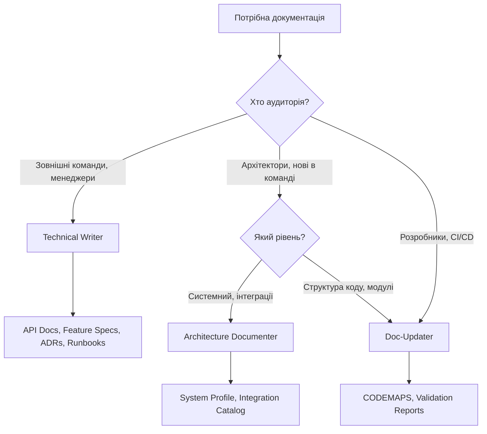
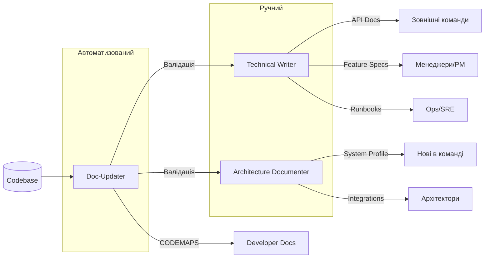

# Агенти документації: Technical Writer vs Architecture Documenter vs Doc-Updater

Три агенти для документації з різними фокусами та підходами.

## Швидке порівняння

| Аспект | Technical Writer | Architecture Documenter | Doc-Updater |
|--------|-----------------|------------------------|-------------|
| **Bias** | Audience first | Diagram first | Generate, don't write |
| **Підхід** | Ручний, детальний | Ручний, високорівневий | Автоматизований, code-driven |
| **Аудиторія** | Зовнішні команди, менеджери | Архітектори, нові члени команди | Розробники, CI/CD |
| **Вивід** | Stoplight.io docs | Confluence MD | CODEMAPS |
| **Тригер** | На запит | На запит | Автоматично/за розкладом |
| **Свіжість** | Ручні оновлення | Квартальний огляд | Авто-валідація |

---

## Коли використовувати кожного



### Technical Writer

**Використовуй коли:**
- Пишеш API документацію для інших команд
- Створюєш feature specs для менеджерів/PM
- Документуєш архітектурні рішення (ADRs)
- Пишеш операційні runbooks для SRE

**Не використовуй для:**
- Внутрішньої документації структури коду
- Автоматичної генерації документації
- Системних оглядів архітектури

### Architecture Documenter

**Використовуй коли:**
- Онбордиш нових членів команди (системний контекст)
- Документуєш зовнішні інтеграції
- Створюєш system profiles для архітекторів
- C4 діаграми, context diagrams

**Не використовуй для:**
- Детальної документації API endpoints
- Документації модулів на рівні коду
- Автоматичних/частих оновлень

### Doc-Updater

**Використовуй коли:**
- Генеруєш codemaps з codebase
- Валідуєш свіжість документації
- CI/CD перевірки документації
- Тримаєш docs в sync з кодом

**Не використовуй для:**
- Документації для stakeholders
- Бізнес-рівневих feature specs
- Високорівневих архітектурних рішень

---

## Порівняння виводу

### Technical Writer Output

```
docs/
├── references/
│   └── openapi.yaml           # API specification
├── features/
│   └── workout-sharing.md     # Feature spec для менеджерів
├── adr/
│   └── 0001-use-redis.md      # Architecture Decision Record
└── runbooks/
    └── billing-service.md     # Operational runbook
```

**Формат:** Stoplight.io compatible (OpenAPI 3.x, Markdown з frontmatter)

### Architecture Documenter Output

```
docs/
└── architecture/
    ├── system-profile.md      # Системний контекст та огляд
    ├── context-diagram.md     # C4 діаграми
    └── integrations/
        ├── README.md          # Каталог інтеграцій
        ├── payment/
        │   ├── apple-app-store.md
        │   └── google-play.md
        └── analytics/
            └── amplitude.md
```

**Формат:** Confluence-compatible Markdown, Mermaid діаграми

### Doc-Updater Output

```
docs/CODEMAPS/
├── INDEX.md                   # Огляд всіх областей
├── controllers.md             # Маппінг API Controllers
├── services.md                # Структура сервісного шару
├── entities.md                # Doctrine entities та зв'язки
├── messages.md                # Message handlers
└── commands.md                # Console commands
```

**Формат:** Авто-згенерований Markdown з freshness metadata

---

## Порівняння Biases

### Technical Writer: "Audience First"

```
Перед написанням будь-чого:
1. ХТО буде це читати?
2. ЩО їм потрібно знати?
3. ЯК вони використають цю інформацію?

Вивід пріоритезує:
- Робочі приклади замість абстрактних пояснень
- Scannable формат (таблиці, списки)
- Без внутрішнього жаргону без пояснення
```

### Architecture Documenter: "Diagram First"

```
Перед написанням будь-чого:
1. Почни з context diagram
2. Покажи межі системи
3. Змапуй інтеграції та потоки даних

Вивід пріоритезує:
- Візуальне представлення (Mermaid)
- Таблиці для структурованих даних
- Посилання на детальну документацію
- Відстеження невідомого (Open Questions)
```

### Doc-Updater: "Generate, Don't Write"

```
Основний принцип:
- Документація має ГЕНЕРУВАТИСЯ з коду
- Ручна документація = застаріла документація
- Код — це джерело правди

Вивід пріоритезує:
- Freshness timestamps
- Валідацію проти актуального коду
- Автоматичну регенерацію
- CI/CD інтеграцію
```

---

## Інтеграція між агентами



### Workflow співпраці

```
1. Doc-Updater генерує CODEMAPS (автоматично)
         ↓
2. Doc-Updater валідує всі docs (щотижня)
         ↓
3. Якщо застарілі API docs → Technical Writer оновлює
4. Якщо застарілий system profile → Architecture Documenter оновлює
5. Якщо новий код не в CODEMAPS → Doc-Updater регенерує
```

### Крос-посилання

| Коли Doc-Updater знаходить... | Пропонує... |
|-------------------------------|-------------|
| Новий API endpoint без документації | `/docs --api <endpoint>` (Technical Writer) |
| Нову інтеграцію не в system profile | `/architecture-docs --integration` (Architecture Documenter) |
| Застарілий feature spec | `/docs --feature <name>` (Technical Writer) |

---

## Маппінг команд

| Агент | Команда | Вивід |
|-------|---------|-------|
| Technical Writer | `/docs --api <endpoint>` | OpenAPI + Mermaid |
| Technical Writer | `/docs --feature <name>` | Feature spec |
| Technical Writer | `/docs --adr <decision>` | ADR |
| Technical Writer | `/docs --runbook <service>` | Runbook |
| Technical Writer | `/docs --validate` | Freshness report |
| Architecture Documenter | `/architecture-docs` | System profile |
| Architecture Documenter | `/architecture-docs --integration` | Integration doc |
| Architecture Documenter | `/architecture-docs --scan` | Integration catalog |
| Doc-Updater | `/codemap` | Всі CODEMAPS |
| Doc-Updater | `/codemap --area <area>` | Конкретний codemap |
| Doc-Updater | `/codemap --validate` | Validation report |

---

## Використані Skills

| Агент | Skills |
|-------|--------|
| Technical Writer | `api-docs-template`, `feature-spec-template`, `adr-template`, `runbook-template`, `readme-template` |
| Architecture Documenter | `system-profile-template`, `integration-template` |
| Doc-Updater | `codemap-template` |

---

## Відповідальність за свіжість

| Тип документа | Відповідальний агент | Поріг свіжості |
|---------------|---------------------|----------------|
| API Docs | Technical Writer | 7-14 днів |
| Feature Specs | Technical Writer | 14-30 днів |
| ADRs | Technical Writer | Річний огляд |
| Runbooks | Technical Writer | 30-60 днів |
| System Profile | Architecture Documenter | 90-180 днів |
| Integrations | Architecture Documenter | 30-90 днів |
| CODEMAPS | Doc-Updater | 7-14 днів |

---

## Підсумок

| Потреба | Агент | Команда |
|---------|-------|---------|
| API docs для інших команд | Technical Writer | `/docs --api` |
| Feature spec для PM | Technical Writer | `/docs --feature` |
| Runbook для SRE | Technical Writer | `/docs --runbook` |
| Системний огляд для нового члена команди | Architecture Documenter | `/architecture-docs` |
| Документація інтеграцій | Architecture Documenter | `/architecture-docs --integration` |
| Мапа структури коду | Doc-Updater | `/codemap` |
| Перевірка свіжості docs | Doc-Updater | `/codemap --validate` або `/docs --validate` |

---

**Запам'ятай:**
- **Technical Writer** = детальний, для зовнішньої аудиторії
- **Architecture Documenter** = високорівневий, для архітекторів
- **Doc-Updater** = автоматизований, для розробників
