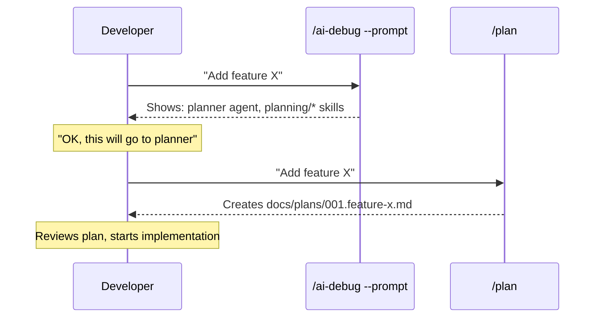

# /plan vs /ai-debug --prompt

Порівняння двох команд, які працюють з текстовими запитами, але мають різне призначення.

## Quick Reference

| Аспект | `/plan` | `/ai-debug --prompt` |
|--------|---------|----------------------|
| **Призначення** | Створити план | Пояснити що станеться |
| **Дія** | Виконує | Аналізує |
| **Агент** | planner | — (meta-analysis) |
| **Output** | Markdown файл | Chat response |
| **Зберігає файл** | `docs/plans/{ver}.{slug}.md` | Ні |

---

## Візуалізація

```mermaid
flowchart LR
    subgraph Input
        R[Request: "Add feature X"]
    end

    subgraph "/ai-debug --prompt"
        A1[Parse request]
        A2[Match triggers]
        A3[Identify agent]
        A4[Show workflow]
    end

    subgraph "/plan"
        P1[Load planner agent]
        P2[Analyze codebase]
        P3[Create steps]
        P4[Save to file]
    end

    R --> A1
    A1 --> A2 --> A3 --> A4
    A4 -->|"Shows: will use planner"| Info[Routing Info]

    R --> P1
    P1 --> P2 --> P3 --> P4
    P4 --> File[docs/plans/001.feature-x.md]
```

---

## Детальне порівняння

### /ai-debug --prompt "request"

**Що робить:** Показує яка послідовність виконання відбудеться для запиту.

**Коли використовувати:**
- Хочеш зрозуміти як система обробить запит
- Навчаєшся користуватися системою
- Debugging routing issues

**Приклад:**

```bash
/ai-debug --prompt "Add workout sharing to social feed"
```

**Output:**
```
🔍 Prompt Analysis: "Add workout sharing to social feed"
══════════════════════════════════════════════════════

📦 Routing
   ├─ Agent:         planner
   │                 agents/technical/planner.md
   ├─ Skills:        planning/planning-template
   │                 risk-management/risk-assessment
   └─ Project Skill: wellness-backend-patterns (if exists)

⚙️  Workflow
   1. Load agent: planner (bias: Clarity Over Speed)
   2. Load skills: planning/*, risk-management/*
   3. Analyze codebase
   4. Generate implementation plan

📤 Output
   ├─ Type:     File
   ├─ Format:   Markdown
   └─ Location: docs/plans/{version}.{slug}.md
```

---

### /plan "request"

**Що робить:** Реально створює детальний план реалізації та зберігає у файл.

**Коли використовувати:**
- Потрібен план для нової фічі
- Плануєш рефакторинг
- Multi-file зміни
- Database migrations

**Приклад:**

```bash
/plan "Add workout sharing to social feed"
```

**Output:**
```
✅ Plan saved: docs/plans/001.workout-sharing-social-feed.md

# Implementation Plan: Workout Sharing to Social Feed

## Overview
Add ability for users to share completed workouts to social feed...

## Implementation Steps

### Phase 1: Data Layer [2h]
#### 1.1 Create ShareWorkoutDTO
**File:** `src/DTO/ShareWorkoutDTO.php`
**Action:** Create DTO for share payload
...
```

---

## Аналогія

| Аналогія | `/ai-debug --prompt` | `/plan` |
|----------|----------------------|---------|
| GPS | Показує маршрут | — |
| Автомобіль | — | Їде по маршруту |
| Меню ресторану | Показує що є | — |
| Кухар | — | Готує страву |
| Документація | Описує як працює | — |
| Виконання | — | Робить роботу |

---

## Workflow: Як використовувати разом



### Recommended Flow

1. **Спочатку** — `/ai-debug --prompt "your request"` — зрозуміти що станеться
2. **Потім** — `/plan "your request"` — отримати реальний план
3. **Далі** — Виконати план крок за кроком

---

## Коли що обирати

### Обери `/ai-debug --prompt` якщо:

- [ ] Не впевнений який агент обробить запит
- [ ] Хочеш побачити які skills будуть завантажені
- [ ] Навчаєшся системі
- [ ] Debugging — чому результат не такий як очікував

### Обери `/plan` якщо:

- [ ] Потрібен готовий план реалізації
- [ ] Збираєшся почати розробку
- [ ] Хочеш зберегти план для команди
- [ ] Потрібна оцінка ризиків та timeline

---

## Summary

```
/ai-debug --prompt = "Покажи що станеться" (meta, read-only)
/plan              = "Зроби план"          (execute, creates file)
```

| Command | Action | Output |
|---------|--------|--------|
| `/ai-debug --prompt "X"` | Explains routing | Chat |
| `/plan "X"` | Creates plan | `docs/plans/*.md` |
