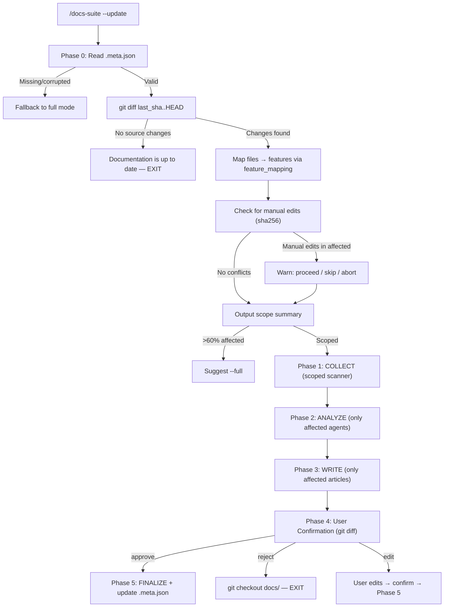

# Інкрементальне оновлення документації (`--update`)

## Проблема

`/docs-suite` за замовчуванням перегенеровує всю документацію повністю. Це:
- Перезаписує ручні правки
- Витрачає повний обсяг tokens на 4 агентів навіть якщо змінився 1 файл
- Генерує "косметичні" відмінності через недетермінованість LLM

## Рішення

Три режими запуску:

```bash
/docs-suite                # Перший запуск — повна генерація
/docs-suite --update       # Повторний — інкрементальне оновлення
/docs-suite --full         # Примусова повна перегенерація
```

## Як працює `--update`

### Діаграма флоу



### Phase 0: Change Detection

Team Lead (без агентів) визначає що змінилось:

1. **Читає `.meta.json`** — SHA останнього запуску, маппінг features → source dirs
2. **`git diff`** — список змінених файлів з коду
3. **Маппінг** — які фічі зачеплені змінами
4. **Перевірка ручних правок** — sha256 артифактів vs збережені хеші
5. **Scope summary** — показує користувачу що буде оновлено

### Phases 1-3: Scoped Execution

Кожен агент отримує `[UPDATE MODE]` секцію в spawn prompt:

| Агент | Що отримує | Що робить |
|-------|-----------|-----------|
| Scanner | `[SCOPE: changed dirs]` + existing report | Оновлює тільки змінені секції звіту |
| Architect | `[EXISTING REPORT]` + `[CHANGES]` | Оновлює тільки зачеплені діаграми |
| API-spec | `[EXISTING SPEC]` + `[CHANGES: controllers]` | Оновлює тільки змінені endpoints |
| Writer | `[AFFECTED FEATURES]` + `[EXISTING ARTICLES]` | Оновлює тільки зачеплені статті |

Незачеплені артифакти не чіпаються.

### Phase 4: User Confirmation

Замість cross-review (який вже пройшов при першому запуску), показується `git diff docs/` і користувач вирішує:

- **approve** — зберегти зміни
- **reject** — відкотити (`git checkout docs/`)
- **edit** — пауза для ручних правок, потім підтвердження

## `.meta.json`

Створюється в Phase 5 кожного запуску. Зберігається в `docs/.artifacts/.meta.json`.

```json
{
  "version": 1,
  "last_run": "2026-03-23T14:30:00Z",
  "last_sha": "abc123def",
  "mode": "full",
  "project_path": "/path/to/project",
  "flags": { "format": "plain", "feature": null, "scope": null },
  "artifacts": {
    "docs/.artifacts/technical-collection-report.md": {
      "sha256": "e3b0c44...", "agent": "technical-collector", "phase": 1
    },
    "docs/features/workouts.md": {
      "sha256": "a1b2c3d...", "agent": "technical-writer", "phase": 3
    }
  },
  "feature_mapping": {
    "workouts": {
      "article": "docs/features/workouts.md",
      "source_dirs": ["src/Workout/", "src/Controller/WorkoutController.php"]
    }
  }
}
```

**Рекомендація:** комітити `.meta.json` в git — він трекає стан документації для команди.

## Edge Cases

| Ситуація | Поведінка |
|----------|----------|
| `.meta.json` відсутній | Fallback на full mode з попередженням |
| `last_sha` не знайдений в git | Fallback на full mode |
| Ручні правки в зачеплених файлах | Попередження + вибір: proceed / skip / abort |
| >60% features зачеплені | Пропозиція використати `--full` |
| Зміна формату (plain → stoplight) | Fallback на full mode |
| Видалені артифакти | Помічаються для перегенерації |

## Приклади

### Оновлення після зміни одного модуля

```bash
# Змінили src/Workout/Service/CalorieCalculator.php
/docs-suite --update
# → Phase 0: 1 file changed, affects "workouts" feature
# → Phase 1: scanner scans only src/Workout/
# → Phase 2: architect updates flows, api-spec updates endpoints
# → Phase 3: writer updates docs/features/workouts.md only
# → Phase 4: git diff → approve
# → Done. 9 of 10 articles untouched.
```

### Перший запуск — нема що оновлювати

```bash
/docs-suite --update
# → Phase 0: .meta.json not found
# → Falling back to full mode
# → (proceeds as /docs-suite --full)
```

### Без змін у коді

```bash
/docs-suite --update
# → Phase 0: No source changes since last run
# → Documentation is up to date. EXIT.
```

### Примусове оновлення

```bash
/docs-suite --full
# → Skips Phase 0, runs full pipeline
# → Overwrites all artifacts
# → Updates .meta.json
```

## Пов'язані файли

- Команда: `commands/docs-suite.md`
- Сценарій: `scenarios/delivery/documentation-suite.md`
- Агенти: `agents/documentation/*.md`
