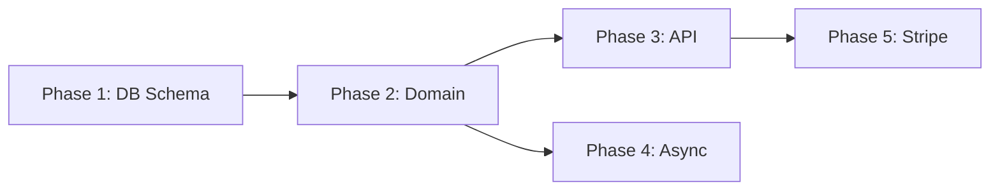

# Phase 3: PLAN

## Команда запуску

```
/plan {feature-name}
```

**Опції:**
- `--max-phases 5` — обмежити кількість фаз (default: без обмежень)
- `--granularity fine` — детальна декомпозиція (більше менших фаз)
- `--granularity coarse` — крупна декомпозиція (менше більших фаз, default)

**Prereq:** Phase 2 (Design) завершена і approved інженерами.

---

## Мета

Декомпозувати Design на фази імплементації. Кожна фаза — окрема задача, яку можна деліверити окремо. Кожна фаза описана в окремому файлі з acceptance criteria.

---

## Agent

| Name | Agent | Model |
|------|-------|-------|
| planner | `agents/engineering/phase-planner.md` | opus |

Один агент (не team) — задача лінійна, не потребує паралелізації.

---

## Процес

```
Input:
  ├── .workflows/{feature}/research/research-report.md
  └── .workflows/{feature}/design/
      ├── architecture.md
      ├── adr.md
      └── test-strategy.md
  │
  ▼
Phase Planner:
  1. Читає Research + Design артефакти
  2. Визначає залежності між компонентами
  3. Групує зміни в логічні фази:
     - Кожна фаза самодостатня (можна мержити окремо)
     - Фази впорядковані за залежностями
     - Кожна фаза включає свої тести
  4. Для кожної фази генерує окремий файл
  5. Генерує overview з порядком і залежностями
  │
  ▼
Output: .workflows/{feature}/plan/
```

---

## Принципи декомпозиції

1. **Vertical slicing** — кожна фаза містить всі шари (entity → service → controller → test), а не горизонтальне розділення
2. **Incremental delivery** — кожна фаза додає видиму цінність
3. **Dependency order** — фази впорядковані так, що кожна будує на попередній
4. **Test inclusion** — тести є частиною фази, а не окремою фазою
5. **Migration safety** — міграції БД ідуть першими, окремою фазою якщо ризиковані

---

## Output Structure

### `.workflows/{feature}/plan/overview.md`

```markdown
# Implementation Plan: {Feature Name}

## Phases

| # | Phase | Dependencies | Estimate | Risk |
|---|-------|-------------|----------|------|
| 1 | Database schema changes | — | S | low |
| 2 | Core domain logic | Phase 1 | M | medium |
| 3 | API endpoints | Phase 2 | M | low |
| 4 | Async processing | Phase 2 | L | high |
| 5 | Integration with Stripe | Phase 3 | M | high |

## Dependency Graph



## Total Scope
- New files: ~{count}
- Modified files: ~{count}
- New tests: ~{count}
- Migrations: {count}
```

### `.workflows/{feature}/plan/phase-{N}.md`

```markdown
# Phase {N}: {Phase Title}

## Goal
{Одне речення — що ця фаза додає}

## Dependencies
- Phase {X} must be completed (needs {component})

## Changes

### New Files
| File | Type | Purpose |
|------|------|---------|
| src/Service/RefundService.php | Service | Core refund logic |
| tests/Functional/RefundTest.php | Test | API test for refund |

### Modified Files
| File | Type | Changes |
|------|------|---------|
| src/Entity/Payment.php | Entity | Add refundedAmount field |

### Migrations
| Migration | Description | Reversible |
|-----------|-------------|------------|
| Version20240315_AddRefundFields | Add refund columns to payments | Yes |

## Implementation Notes
- {Конкретні вказівки для Code Writer}
- {Важливі constraints з Design}

## Tests Required
| Test | Type | Covers |
|------|------|--------|
| RefundService::calculate | Unit | Calculation logic |
| POST /api/v2/payments/{id}/refund | Functional | Happy path + validation |

## Acceptance Criteria
- [ ] {Конкретна умова що фаза завершена}
- [ ] All new code has tests
- [ ] No existing tests broken
- [ ] Migration is reversible

## Estimated Size
S / M / L / XL

## Run Command
```
/implement {feature-name} --phase {N}
```
```

---

## Gate

Planner перевіряє перед завершенням:
- [ ] Кожна фаза має acceptance criteria
- [ ] Залежності між фазами не циклічні
- [ ] Кожна фаза самодостатня (можна мержити без наступних)
- [ ] Тести включені в кожну фазу
- [ ] overview.md має dependency graph
- [ ] Всі компоненти з Design покриті фазами

---

## Anti-Patterns

1. **Horizontal slicing** — "Phase 1: all entities, Phase 2: all services" — неможливо тестувати ізольовано
2. **God phase** — одна фаза з 20+ файлами. Потрібно розбити
3. **Tests as separate phase** — тести пишуться разом з кодом
4. **Missing dependencies** — Phase 3 потребує Phase 2, але це не вказано
5. **No acceptance criteria** — без критеріїв неможливо визначити що фаза завершена
