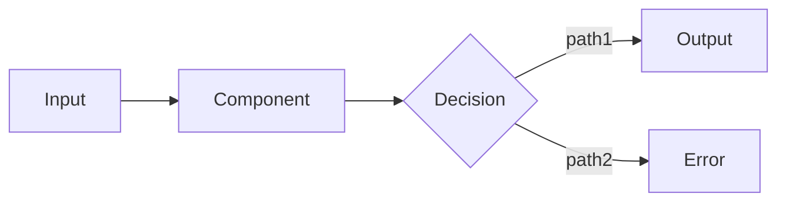
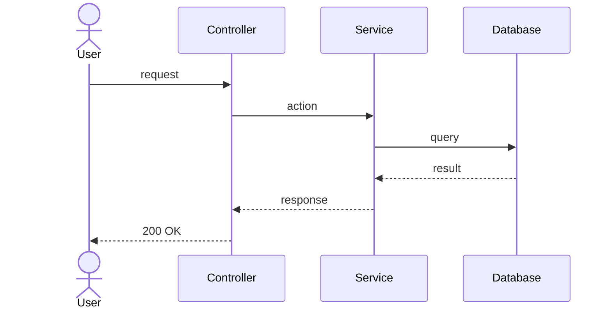
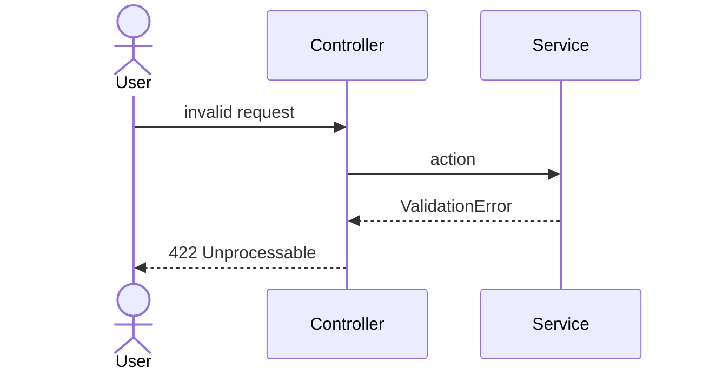

# Design Template Skill

Defines the format for architecture design artifacts produced during `/design` phase. Design Architect uses these templates to structure output.

## When This Skill Applies

- Design Architect creating `diagrams.md` and `architecture.md`
- Reviewing design artifacts for format compliance
- Creating design documentation outside `/design` flow

## Artifacts

### diagrams.md

All Mermaid diagrams in a single file. Each diagram has a title and 1-2 sentence explanation.

```markdown
# Diagrams: {Feature Name}

## Component Diagram (C4 Level 2)

{What this diagram shows — which components are new/changed and how they relate}

```mermaid
C4Component
    title Component Diagram: {Feature}

    Container_Boundary(layer, "Layer Name") {
        Component(id, "Name", "Technology", "Description")
        Component(new_id, "NewComponent", "Technology", "NEW: Description")
    }

    Rel(source, target, "relationship")
```

## Data Flow

{What this diagram shows — how data moves through the system after changes}



## Sequence Diagrams

### Main Flow (Happy Path)



### Error Flow


```

### architecture.md

Textual architecture description — NO inline diagrams (they live in diagrams.md).

```markdown
# Architecture Design: {Feature Name}

## Overview

{1-2 sentences — what changes in the architecture}
Diagrams: see [diagrams.md](diagrams.md)

## New / Changed Components

| Component | Type | Action | Responsibility |
|-----------|------|--------|---------------|
| {Name} | Service / Controller / Entity / Handler / ... | NEW / MODIFY / DELETE | {what it does} |

## Key Design Decisions

{Brief list of decisions — details in adr/ directory}

1. **{Decision title}** — {chosen option and why in 1 sentence}
2. **{Decision title}** — {chosen option and why in 1 sentence}

## Non-Functional Requirements

| Requirement | Target | Basis |
|------------|--------|-------|
| Expected throughput | {N requests/sec or messages/sec} | {source of estimate} |
| Latency (p95) | {N ms} | {acceptable for UX/SLA} |
| Data volume (1 year) | {estimate} | {growth rate} |
| Availability | {N% or "same as current"} | {business requirement} |

*Omit rows that are not relevant. For `light` depth — omit entire section.*

## Async Flows

| Event/Message | Producer | Consumer | Purpose |
|--------------|----------|----------|---------|
| {Name} | {Component} | {Handler} | {what it does} |

*Omit this section if no async flows.*

## Operations (detailed depth only)

| Aspect | Plan |
|--------|------|
| Deployment | {how to deploy — feature flag, rolling, blue-green} |
| Monitoring | {what metrics/logs to watch} |
| Alerting | {what triggers alerts} |
| Rollback | {how to rollback if something goes wrong} |

*Only for `detailed` depth. Omit for `light` and `standard`.*

## Open Questions (from Research)

| Question | Status | Resolution |
|----------|--------|------------|
| {question} | resolved / open | {answer or "needs discussion"} |
```

## Design Depth Levels

| Level | diagrams.md | architecture.md |
|-------|------------|-----------------|
| **light** | C4 Context + 1 Sequence | Components table + Key Decisions |
| **standard** | C4 Component + DataFlow + Sequence (happy + error) | All sections including NFR |
| **detailed** | All standard + deployment diagram | All standard + NFR + Operations (deployment, monitoring, alerting, rollback) + Data Migration Plan |

## Mermaid Conventions

- Use `C4Component` for component diagrams (not `graph` or `flowchart`)
- Mark new components with `"NEW: description"` in the description field
- Use `flowchart LR` (left-to-right) for data flow, `flowchart TD` for hierarchies
- Sequence diagrams: use `actor` for users, `participant` for system components
- Keep diagram titles short — details go in the text above the diagram
