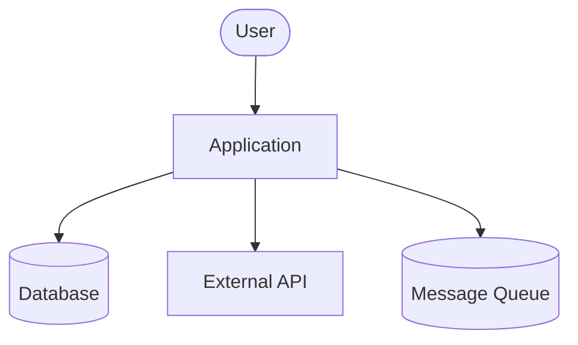
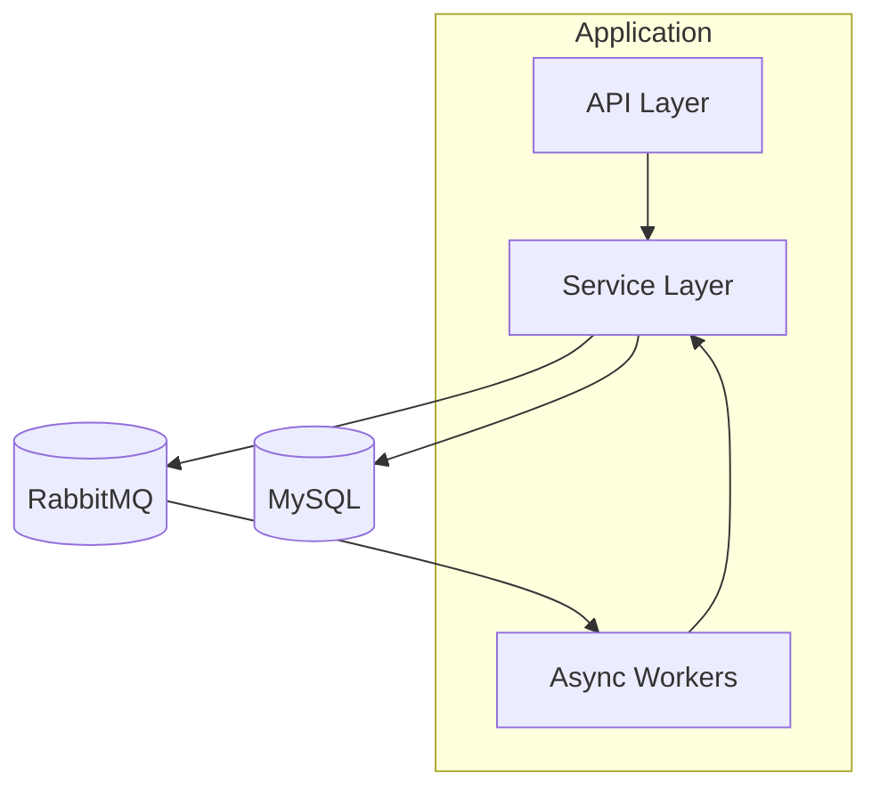
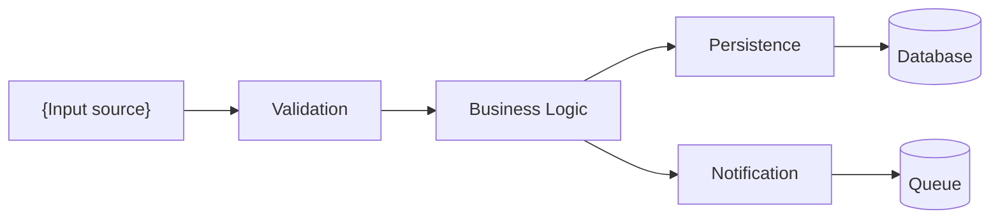
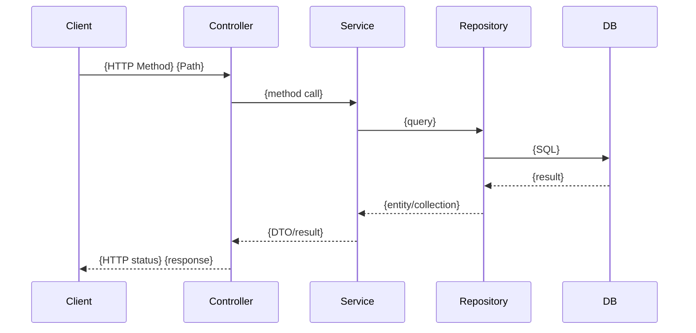
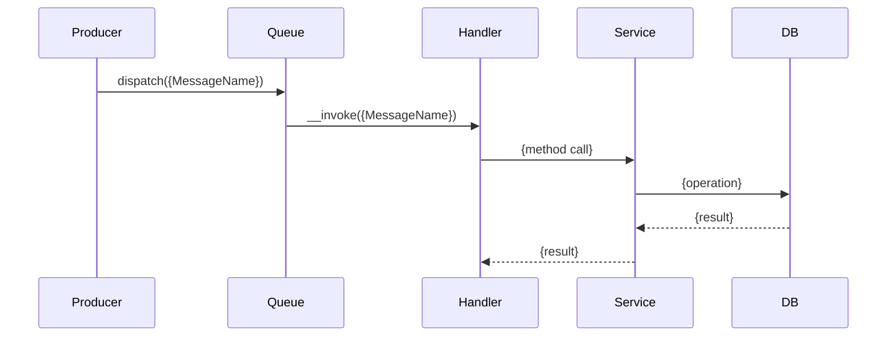
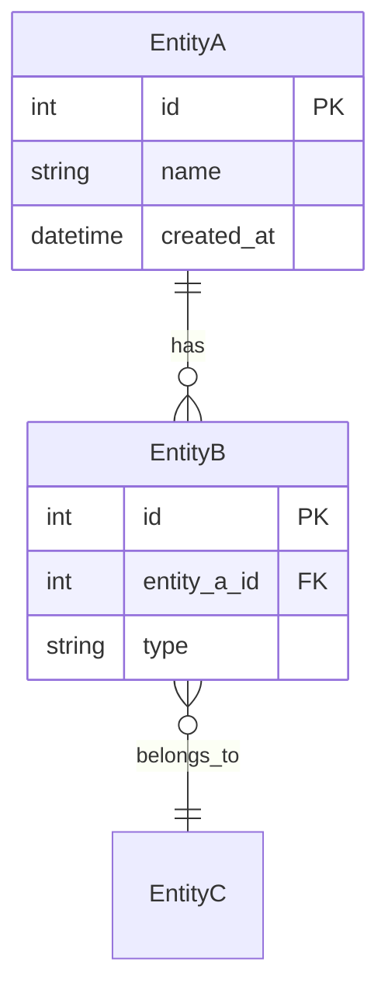
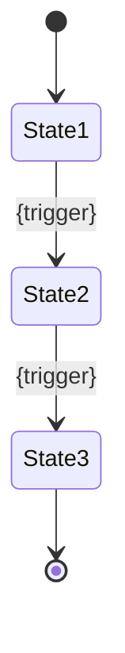

# Design Template

## Purpose

Provide standardized templates for all files produced during the Design step of the /dev workflow. Design translates Research findings into a concrete implementation plan with architecture decisions, API contracts, and visual diagrams.

## ADR Auto-Count Rule

- **1-2 decisions**: Create a single ADR file at `adr/001-{slug}.md` alongside DESIGN.md.
- **3+ decisions**: Create a separate ADR file per decision in an `adr/` directory with an index.

```
# 1-2 decisions:
design/
├── DESIGN.md
├── diagrams.md
├── api-contracts.md
└── adr/
    └── 001-{decision-slug}.md

# 3+ decisions:
design/
├── DESIGN.md
├── diagrams.md
├── api-contracts.md
└── adr/
    ├── README.md          # ADR index
    ├── 001-{slug}.md
    ├── 002-{slug}.md
    └── 003-{slug}.md
```

---

## File Structure

Design produces 3 core files plus ADR(s):

```
design/
├── DESIGN.md           # Lead file — overview, component changes, strategy
├── diagrams.md         # All visual diagrams (C4, data flow, sequence)
├── api-contracts.md    # Endpoint definitions, request/response schemas
└── adr/                # Architecture Decision Records (1+ files)
```

---

## Template: DESIGN.md

The lead design file. References diagrams, API contracts, and ADRs.

```markdown
# Design: {Task Name}

## Overview

{2-3 sentences describing what we are building and why. Reference the Research phase for context.}

## Architecture Changes

See [diagrams.md](diagrams.md) for visual representations.

### New Components

```
src/
├── {NewDirectory}/
│   ├── {NewFile1}.php       # {Purpose}
│   ├── {NewFile2}.php       # {Purpose}
│   └── {NewFile3}.php       # {Purpose}
└── {ExistingDirectory}/
    └── {NewFile4}.php       # {Purpose}
```

### Modified Components

| File | Changes | Risk |
|------|---------|------|
| {src/path/ExistingFile.php} | {Description of changes} | {Low/Medium/High} |
| {src/path/ExistingFile.php} | {Description of changes} | {Low/Medium/High} |

### Removed Components

| File | Reason |
|------|--------|
| {src/path/File.php} | {Why this file is being removed} |

## API Changes

See [api-contracts.md](api-contracts.md) for detailed contracts.

### Summary

| Method | Path | Purpose | Breaking Change |
|--------|------|---------|-----------------|
| {GET/POST/PUT/DELETE} | {/api/v1/resource} | {What this endpoint does} | {Yes/No} |

## Decisions

See [adr/](adr/) for Architecture Decision Records.

| ADR | Decision | Status |
|-----|----------|--------|
| [ADR-001](adr/001-{slug}.md) | {Decision title} | Proposed |

## Data Model Changes

### New Entities

| Entity | Table | Key Fields | Relations |
|--------|-------|------------|-----------|
| {EntityName} | {table_name} | {field1, field2} | {Relations} |

### Entity Modifications

| Entity | Change | Migration Safety |
|--------|--------|-----------------|
| {EntityName} | {Add column X, modify index Y} | {Safe / Requires online DDL / Multi-step} |

### Migration Plan

{Order and approach for database migrations. Reference database rules for safe migration patterns.}

## Message Changes

### New Messages

| Message | Handler | Transport | Idempotent |
|---------|---------|-----------|------------|
| {MessageName} | {HandlerName} | {async/sync} | {Yes — describe key} |

### Modified Handlers

| Handler | Change | Backward Compatible |
|---------|--------|---------------------|
| {HandlerName} | {Description} | {Yes/No} |

## Testing Strategy

### Unit Tests

| Test | Covers | Priority |
|------|--------|----------|
| {TestClassName} | {What it validates} | {P0/P1/P2} |

### Integration Tests

| Test | Covers | Priority |
|------|--------|----------|
| {TestClassName} | {What flow it validates} | {P0/P1/P2} |

### Functional Tests

| Test | Covers | Priority |
|------|--------|----------|
| {TestClassName} | {What end-to-end scenario it validates} | {P0/P1/P2} |

## Risks & Mitigations

| Risk | Probability | Impact | Mitigation |
|------|-------------|--------|------------|
| {Risk description} | {Low/Medium/High} | {Low/Medium/High} | {How to prevent or handle} |

## Implementation Order

{Recommended order of implementation with dependencies between steps.}

1. **{Step 1}** — {What and why first}
2. **{Step 2}** — {Depends on step 1 because...}
3. **{Step 3}** — {Can be parallelized with step 2}
```

---

## Template: diagrams.md

All visual diagrams for the design. Uses Mermaid syntax for portability.

```markdown
# Diagrams: {Task Name}

## C4 Context Diagram

{System context — shows how the system interacts with users and external systems.}



## C4 Container Diagram

{Zoom into the application — shows major containers/services and their interactions.}



## Data Flow Diagram

{Shows how data moves through the system for the feature being designed.}



## Sequence Diagrams

### {Flow 1 Name}

{Describe what this flow represents.}



### {Flow 2 Name}

{Describe what this flow represents.}



## Entity Relationship Changes

{Shows new and modified entity relationships.}



## State Diagram

{If the feature involves state transitions, document them here. Remove this section if not applicable.}


```

---

## Template: api-contracts.md

Defines endpoint contracts with request/response schemas.

```markdown
# API Contracts: {Task Name}

## Endpoints

### {METHOD} {/api/v1/path}

**Purpose**: {What this endpoint does}
**Auth**: {Required role or scope, e.g., ROLE_USER, Bearer token}
**Rate Limit**: {If applicable, e.g., 100 req/min}

**Request**:

Headers:
```
Authorization: Bearer {token}
Content-Type: application/json
```

Body:
```json
{
    "field1": "string (required) — description",
    "field2": 123,
    "field3": "string (optional) — description"
}
```

**Response** (200 OK):
```json
{
    "id": "uuid",
    "field1": "value",
    "createdAt": "2024-01-15T10:30:00Z"
}
```

**Response** (201 Created):
```json
{
    "id": "uuid",
    "field1": "value"
}
```

**Errors**:

| Status | Code | Description |
|--------|------|-------------|
| 400 | VALIDATION_ERROR | {When request body is invalid} |
| 401 | UNAUTHORIZED | {When token is missing or invalid} |
| 403 | FORBIDDEN | {When user lacks permission} |
| 404 | NOT_FOUND | {When resource does not exist} |
| 409 | CONFLICT | {When resource state prevents action} |
| 422 | UNPROCESSABLE_ENTITY | {When business rule is violated} |

---

### {METHOD} {/api/v1/path/:id}

{Repeat the same structure for each endpoint.}

---

## Schema Definitions

{Shared schemas and DTOs referenced by multiple endpoints.}

### {SchemaName}

```json
{
    "$schema": "http://json-schema.org/draft-07/schema#",
    "type": "object",
    "required": ["field1", "field2"],
    "properties": {
        "field1": {
            "type": "string",
            "description": "{what this field represents}"
        },
        "field2": {
            "type": "integer",
            "minimum": 0,
            "description": "{what this field represents}"
        },
        "field3": {
            "type": "string",
            "enum": ["value1", "value2", "value3"],
            "description": "{what this field represents}"
        }
    }
}
```

### Error Response Schema

```json
{
    "type": "object",
    "properties": {
        "code": {
            "type": "string",
            "description": "Machine-readable error code"
        },
        "message": {
            "type": "string",
            "description": "Human-readable error description"
        },
        "details": {
            "type": "array",
            "items": {
                "type": "object",
                "properties": {
                    "field": { "type": "string" },
                    "message": { "type": "string" }
                }
            },
            "description": "Field-level validation errors (optional)"
        }
    }
}
```

## Pagination

{If any endpoint returns paginated results, document the pagination contract.}

**Query Parameters**:
- `page` (integer, default: 1) — page number
- `limit` (integer, default: 20, max: 100) — items per page

**Paginated Response Envelope**:
```json
{
    "data": [],
    "meta": {
        "page": 1,
        "limit": 20,
        "total": 150,
        "totalPages": 8
    }
}
```

## Versioning

{Document API versioning strategy if this introduces a new version or affects existing versions.}
```

---

## ADR Templates

Use the ADR template from `skills/documentation/adr-template.md`. Apply the auto-count rule:

- **1-2 decisions**: Single file `adr/001-{slug}.md` using the Lightweight ADR format.
- **3+ decisions**: Separate files in `adr/` directory with a `README.md` index, using the full ADR format.

### ADR Index Template (for 3+ decisions)

```markdown
# Architecture Decision Records: {Task Name}

| ADR | Title | Status | Date |
|-----|-------|--------|------|
| [001](001-{slug}.md) | {Decision title} | Proposed | YYYY-MM-DD |
| [002](002-{slug}.md) | {Decision title} | Proposed | YYYY-MM-DD |
| [003](003-{slug}.md) | {Decision title} | Proposed | YYYY-MM-DD |
```

---

## Validation Checklist

Before completing Design:

- [ ] DESIGN.md references all supporting files (diagrams, api-contracts, ADRs)
- [ ] All new components listed with file paths and purposes
- [ ] All modified components listed with change descriptions and risk levels
- [ ] API contracts include request, response, and error definitions
- [ ] Diagrams use Mermaid syntax and render correctly
- [ ] ADR auto-count rule applied (1-2 = single file, 3+ = directory)
- [ ] Testing strategy covers unit, integration, and functional levels
- [ ] Risks identified with probability, impact, and mitigation
- [ ] Implementation order defined with dependencies
- [ ] Data model changes include migration safety assessment
- [ ] Message changes document idempotency approach
