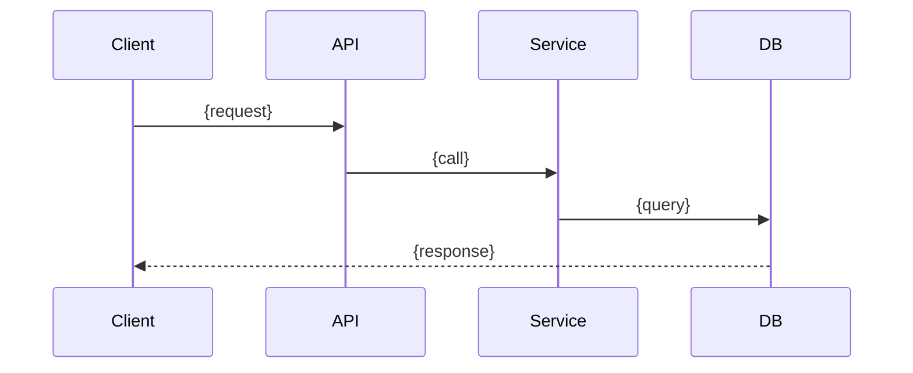

# Document Template

## Purpose

Provide standardized templates for all files produced during the Document step of the /dev workflow. The Document step generates bounded-context documentation for the implemented feature and incrementally updates existing project documentation.

---

## File Structure

Document step produces 5 internal files plus project-level updates:

```
.workflows/document/
├── DOCS.md              # Lead file — summary of all documentation changes
├── feature-spec.md      # Track A: generated feature spec (working copy)
├── api-changes.md       # Track A: API delta (OpenAPI snippet)
├── adr-updates.md       # Track A: ADR status change log
└── delta-report.md      # Track B: existing docs delta scan findings

docs/ (project-level, committed to repo):
├── features/{slug}.md   # CREATE — feature spec (from feature-spec.md)
├── references/openapi.yaml  # UPDATE — appended new endpoints
├── adr/*.md             # UPDATE — status Proposed → Accepted
├── CODEMAPS/*.md        # UPDATE — stale entries fixed
└── INDEX.md             # UPDATE — new feature entry added
```

---

## Template: DOCS.md

The lead documentation file. Summarizes all changes from both tracks.

```markdown
# Documentation: {Feature Name}

## Summary
- **Feature Spec**: Created / Skipped
- **API Docs**: Updated / No changes / N/A
- **ADRs Finalized**: {count}
- **Existing Docs Updated**: {count} files
- **Stale References Found**: {count}
- **Total Doc Files Changed**: {count}

---

## Track A: Bounded Context Documentation

### Feature Spec
- **Created**: `docs/features/{slug}.md`
- **Audience**: {Managers, other team leads, external integrators}
- **Includes**: Overview, API changes, architecture diagram, security notes

### API Documentation
- **Updated**: `docs/references/openapi.yaml`
- **New Endpoints**: {count}
- **Modified Endpoints**: {count}
- **Details**: See [api-changes.md](api-changes.md)

### ADR Finalization
| ADR | Original Status | New Status | Notes |
|-----|-----------------|------------|-------|
| [ADR-001](../../docs/adr/001-{slug}.md) | Proposed | Accepted | {Implementation matches design / deviation noted} |

---

## Track B: General Documentation Delta

### Delta Report Summary
| Category | Count | Auto-Fixed | Manual Review |
|----------|-------|------------|---------------|
| Stale references | {N} | {N} | {N} |
| Missing entries | {N} | {N} | {N} |
| Broken links | {N} | {N} | {N} |

### Files Updated
| File | Changes | Category |
|------|---------|----------|
| {docs/path} | {description of change} | {STALE/MISSING/BROKEN_LINK} |

### Deferred Items
{Items not auto-fixed that require manual review, or "None"}

---

## Code Issues Found
{Reference to CODE-ISSUE.md if created, otherwise "None"}
```

---

## Template: Feature Spec (Compact)

Used for task-scoped feature documentation. This is the **compact version** of `skills/documentation/feature-spec-template.md`.

```markdown
---
stoplight-id: feature-{slug}
last_updated: YYYY-MM-DD
---

# Feature: {Feature Name}

**Status**: {In Development / Released} | **Owner**: @{team} | **Updated**: {date}

## Overview
{2-3 sentences: what this feature does and why. From DESIGN.md.}

## API Changes
| Method | Path | Purpose | Status |
|--------|------|---------|--------|
| {GET/POST/...} | {/api/v1/path} | {What it does} | {New / Modified} |

→ [Full API Documentation](../references/openapi.yaml)

## Architecture
{Simplified Mermaid diagram from design — sequence or flowchart, one diagram max.}



## Decisions
| ADR | Decision | Status |
|-----|----------|--------|
| [ADR-{NNN}](../adr/{NNN}-{slug}.md) | {title} | Accepted |

## Security
- **OWASP**: {PASS / summary}
- **PII/PHI**: {PASS / summary}

## Integration Points
| Dependency | Team | Status |
|------------|------|--------|
| {service/API} | {team} | {Ready / In Progress} |
```

---

## Template: api-changes.md

API delta documentation — OpenAPI snippet for new/changed endpoints.

```markdown
# API Changes: {Feature Name}

## New Endpoints

### {METHOD} {/api/v1/path}

**Summary**: {What this endpoint does}
**Auth**: {Required role/scope}

**Request**:
```json
{
    "field1": "string (required)",
    "field2": 123
}
```

**Response** ({status}):
```json
{
    "id": "uuid",
    "field1": "value"
}
```

**Errors**:
| Status | Code | Description |
|--------|------|-------------|
| 401 | UNAUTHORIZED | Missing/invalid token |
| 422 | VALIDATION_ERROR | Invalid request body |

---

## OpenAPI Snippet

Append to `docs/references/openapi.yaml`:

```yaml
  /api/v1/{resource}:
    post:
      summary: {summary}
      operationId: {operationId}
      tags: [{tag}]
      security:
        - BearerAuth: []
      requestBody:
        required: true
        content:
          application/json:
            schema:
              $ref: '#/components/schemas/{Schema}'
      responses:
        '201':
          description: Created
          content:
            application/json:
              schema:
                $ref: '#/components/schemas/{ResponseSchema}'
        '401':
          $ref: '#/components/responses/Unauthorized'
        '422':
          $ref: '#/components/responses/ValidationError'
```
```

---

## Template: adr-updates.md

Log of ADR status changes during finalization.

```markdown
# ADR Updates: {Feature Name}

## Changes

| ADR | Title | Previous Status | New Status | Action |
|-----|-------|-----------------|------------|--------|
| {001} | {title} | Proposed | Accepted | Copied to docs/adr/ |
| {002} | {title} | Proposed | Accepted (with notes) | Implementation Notes added |

## Details

### ADR-{NNN}: {Title}
- **Status change**: Proposed → Accepted
- **Implementation match**: {Yes / Deviation noted}
- **Notes**: {If deviation: what changed and why}
- **Location**: `docs/adr/{NNN}-{slug}.md`
```

---

## Template: delta-report.md

Delta scan findings from Track B.

```markdown
# Delta Report: {Feature Name}

## Summary
- **Files scanned**: {count} docs files checked
- **Changed code files**: {count} (from PROGRESS.md)
- **Findings**: {total count}
- **Auto-fixed**: {count}
- **Manual review needed**: {count}
- **Escalation**: {Yes — recommend /docs-suite / No}

## Findings

### STALE References
| # | File | Line | Issue | Fix Applied |
|---|------|------|-------|-------------|
| 1 | {docs/path} | {line} | {class/method renamed} | {Yes — updated / No — manual} |

### MISSING Documentation
| # | New Code | Expected In | Fix Applied |
|---|----------|-------------|-------------|
| 1 | {src/Service/NewService.php} | {docs/CODEMAPS/services.md} | {Yes — entry added / No} |

### BROKEN Links
| # | File | Link | Issue | Fix Applied |
|---|------|------|-------|-------------|
| 1 | {docs/path} | {broken link} | {target moved/deleted} | {Yes — updated / No} |

## Deferred Items
{Items requiring manual review — too complex or ambiguous for auto-fix}

## Recommendation
{If > 10 findings: "Documentation significantly stale. Consider running `/docs-suite` for full regeneration."}
{If <= 10: "Documentation up to date after delta fixes."}
```

---

## Template: CODE-ISSUE.md

Created only when Document step reveals significant code issues.

```markdown
# Code Issue Found During Documentation

## Source
Document step, Phase 2 ({Track A / Track B})

## Issue
{Description of what was found — e.g., API endpoint in design not implemented,
ADR decision not followed in code}

## Evidence
- **Expected** (from design): {what design says}
- **Actual** (in code): {what code does}
- **File**: `{file_path}:{line}`

## Impact
- Design assumption: {what was assumed}
- Reality: {what was found}
- Affected documentation: {which docs are impacted}

## Recommendation
- [ ] Return to Implement step to fix code
- [ ] Proceed and track as tech debt
- [ ] Update design to match implementation (if implementation is correct)

## Decision
{User fills this in: chosen action}
```

---

## Validation Checklist

Before completing Document step:

- [ ] Feature spec exists at `docs/features/{slug}.md` (compact format)
- [ ] Feature spec has Overview, API Changes, Architecture diagram, Security notes
- [ ] API changes documented (if new endpoints exist)
- [ ] ADRs finalized — status updated to Accepted (or Accepted with notes)
- [ ] Delta report exists with finding counts
- [ ] Auto-fixes applied where safe
- [ ] DOCS.md summarizes all changes from both tracks
- [ ] No full regeneration attempted (scope control respected)
- [ ] docs/ changes are project-level (committed to repo, not in .workflows/)
- [ ] .workflows/document/ contains internal artifacts only
