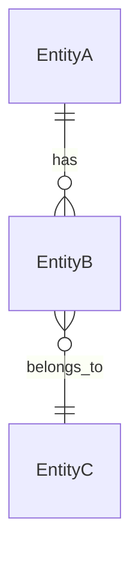
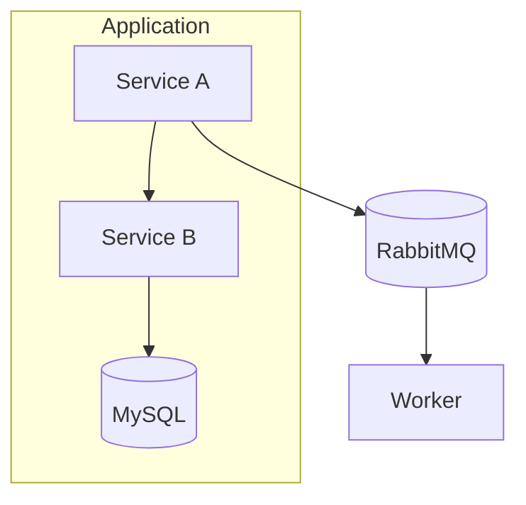

# Research Template

## Purpose

Provide standardized templates for all 5 files produced during the Research step of the /dev workflow. Research is a fact-gathering phase that documents the current state of the codebase and system — it does NOT propose changes or solutions.

## Critical Rule: AS-IS Only

ALL content in Research files MUST describe the **current state** of the system exactly as it exists today.

**Allowed**: Observations, facts, measurements, existing patterns, current behavior.
**Forbidden**: Proposals, recommendations, suggestions, "should", "could", "we need to", future tense improvements.

If you catch yourself writing a recommendation, stop and rephrase it as an observation or move it to Open Questions.

---

## File Structure

Research produces exactly 5 files:

```
research/
├── RESEARCH.md              # Lead file — aggregates findings, links to details
├── code-analysis.md         # Affected components, dependencies, patterns
├── data-model.md            # Entities, DTOs, migration state
├── architecture-analysis.md # System context, integrations, message flows
└── test-coverage.md         # Existing tests, coverage gaps, test patterns
```

---

## Template: RESEARCH.md

The lead aggregation file. Links to detail files and summarizes cross-cutting findings.

```markdown
# Research: {Task Name}

## Task

{Original task description — copy verbatim from the task request}

## Scope & Boundaries

**In scope**:
- {Area or component that this task touches}
- {Area or component that this task touches}

**Out of scope**:
- {Area explicitly excluded}
- {Area explicitly excluded}

## Affected Areas

| Area | Detail File | Key Findings |
|------|-------------|--------------|
| Code | [code-analysis.md](code-analysis.md) | {1-2 sentence summary of key findings} |
| Data Model | [data-model.md](data-model.md) | {1-2 sentence summary of key findings} |
| Architecture | [architecture-analysis.md](architecture-analysis.md) | {1-2 sentence summary of key findings} |
| Tests | [test-coverage.md](test-coverage.md) | {1-2 sentence summary of key findings} |

## Cross-Cutting Concerns

{Issues that span multiple research areas. Examples:
- A naming inconsistency that appears in code, data model, and tests
- A pattern that is partially applied across components
- A dependency that affects both architecture and test isolation}

## Constraints & Limitations

{Technical or business constraints discovered during research. Examples:
- Database table X has 50M rows — schema changes require online DDL
- Service Y has no staging environment — cannot test integration in isolation
- Library Z is pinned to version 1.x due to PHP 8.3 compatibility}

## Open Questions

| ID | Question | Source | Suggested Owner |
|----|----------|--------|-----------------|
| OQ-1 | {question that research could not answer} | {which detail file raised it} | @{team or person} |
| OQ-2 | {question that needs human decision} | {which detail file raised it} | @{team or person} |
```

---

## Template: code-analysis.md

Documents affected code components, their relationships, and observed patterns.

```markdown
# Code Analysis: {Task Name}

## Affected Components

| Component | File | Purpose | Complexity | Dependencies |
|-----------|------|---------|------------|--------------|
| {ClassName} | {src/path/File.php} | {What this class does} | {Low/Medium/High} | {List of injected dependencies} |
| {ClassName} | {src/path/File.php} | {What this class does} | {Low/Medium/High} | {List of injected dependencies} |

## Component Interactions

{Describe how affected components call each other — document the actual code flow, not a desired flow.}

```mermaid
flowchart LR
    A[ComponentA] -->|calls method()| B[ComponentB]
    B -->|dispatches| C[MessageHandler]
```

{Narrative description of the flow with file:line references where helpful.}

## External Dependencies

| Package | Version | Used For |
|---------|---------|----------|
| {vendor/package} | {^X.Y} | {What it provides to affected code} |

## Key Code Patterns

{Patterns found in the affected code. Document what IS, not what should be.}

- **Pattern**: {Name or description}
  **Where**: {File(s) where this pattern appears}
  **Detail**: {How the pattern is implemented}

- **Pattern**: {Name or description}
  **Where**: {File(s) where this pattern appears}
  **Detail**: {How the pattern is implemented}

## Inconsistencies Observed

{Any inconsistencies within the affected code — different patterns used for the same purpose, naming mismatches, etc. State facts only.}
```

---

## Template: data-model.md

Documents entities, DTOs, and current database schema state relevant to the task.

```markdown
# Data Model Analysis: {Task Name}

## Affected Entities

| Entity | Table | Key Fields | Relations |
|--------|-------|------------|-----------|
| {EntityName} | {table_name} | {field1, field2, ...} | {HasMany: X, BelongsTo: Y} |
| {EntityName} | {table_name} | {field1, field2, ...} | {HasMany: X, BelongsTo: Y} |

## Entity Diagram



## DTO Structure

| DTO | Used In | Fields |
|-----|---------|--------|
| {DTOName} | {Controller/Service where used} | {field1: type, field2: type} |

## Current Schema State

{Relevant details about current DB schema: column types, indexes, constraints.}

### Indexes on Affected Tables

| Table | Index | Columns | Type |
|-------|-------|---------|------|
| {table_name} | {idx_name} | {col1, col2} | {BTREE/UNIQUE/FULLTEXT} |

## Migration Considerations

{Current state of DB schema relevant to task. Document facts:
- Table sizes (approximate row counts if known)
- Recent migrations that touched affected tables
- Existing column constraints that are relevant}
```

---

## Template: architecture-analysis.md

Documents system context, integrations, and message flows in the affected area.

```markdown
# Architecture Analysis: {Task Name}

## Current Architecture

{Mermaid diagram showing the current state of the affected area — services, databases, queues, external systems.}



## Relevant Integrations

| Integration | Type | Direction | Data Exchanged |
|-------------|------|-----------|----------------|
| {System/Service} | {REST API / Message / Event / DB} | {Inbound / Outbound / Bidirectional} | {What data flows through} |

## System Boundaries

{Which services/modules are involved and how they connect. Document the current boundaries, not desired ones.}

- **{Module/Service}**: {Role in the current architecture}
- **{Module/Service}**: {Role in the current architecture}

## Message Flows

{Existing message/event patterns in the affected area.}

| Message | Producer | Consumer | Transport | Async |
|---------|----------|----------|-----------|-------|
| {MessageName} | {ProducerClass} | {HandlerClass} | {async/sync/async_priority} | {Yes/No} |

## Configuration

{Relevant configuration: environment variables, service definitions, routing rules that affect the task area.}
```

---

## Template: test-coverage.md

Documents existing test coverage, gaps, and patterns in the affected area.

```markdown
# Test Coverage Analysis: {Task Name}

## Existing Tests

| Test File | Covers | Type | Status |
|-----------|--------|------|--------|
| {tests/path/TestFile.php} | {What component/flow it tests} | {Unit/Integration/Functional} | {Passing/Failing/Skipped} |

## Coverage Summary

| Component | Line Coverage | Branch Coverage | Notes |
|-----------|-------------|----------------|-------|
| {ClassName} | {X%} | {X%} | {Any relevant notes} |

## Coverage Gaps

{What is NOT tested in the affected code. State observations only.}

- {Component or method} — no tests exist
- {Scenario} — not covered by any test
- {Edge case} — not tested

## Test Patterns Used

{How tests are structured in this area of the codebase.}

- **Mocking strategy**: {How dependencies are mocked — Prophecy, PHPUnit mocks, custom fakes}
- **Data setup**: {Factories, fixtures, inline setup}
- **Assertions style**: {What assertion patterns are common}
- **Test isolation**: {How tests handle DB state — transactions, truncation, in-memory}

## Test Infrastructure

{Relevant test configuration: PHPUnit groups, CI pipeline specifics, test databases.}
```

---

## Validation Checklist

Before completing Research:

- [ ] All 5 files created and cross-linked
- [ ] RESEARCH.md links to all 4 detail files
- [ ] Every finding is an AS-IS observation (no proposals)
- [ ] Open Questions captured for anything research could not answer
- [ ] File paths reference actual files in the codebase
- [ ] Mermaid diagrams reflect current state, not future state
- [ ] Cross-Cutting Concerns identified (issues spanning multiple files)
- [ ] Scope & Boundaries clearly defined
