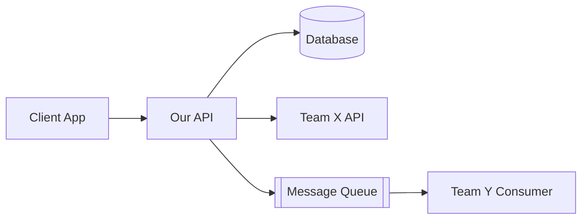
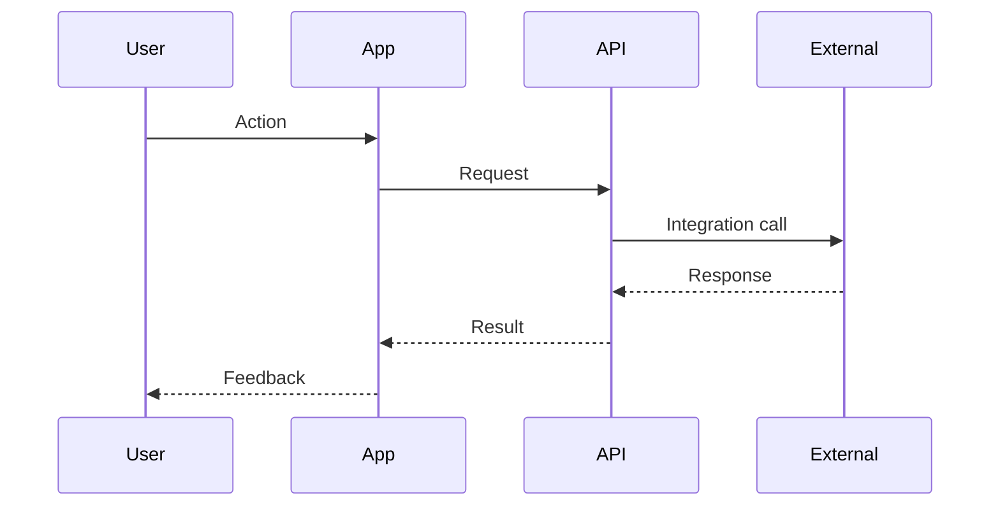

# Feature Specification Template

## Purpose
Document feature scope, status, and dependencies for manager visibility and cross-team coordination.

## Freshness Metadata

Feature specs MUST include freshness tracking in Status section.

## Audience
- **Managers/PMs**: Track feature progress and scope
- **Other team leads**: Understand integration points
- **Stakeholders**: Visibility into what's being built

---

## Template

```markdown
---
stoplight-id: feature-{feature-slug}
last_updated: YYYY-MM-DD
validation_status: current  # current | needs-review | outdated
---

# Feature: {Feature Name}

## Status

| Aspect | Value |
|--------|-------|
| **Status** | Draft / In Development / Testing / Released |
| **Last Updated** | YYYY-MM-DD |
| **Target Release** | YYYY-QN or specific date |
| **Owner** | @team-name or @person |
| **Epic/Ticket** | JIRA-123 or link |
| **Dependencies** | Team X (Service Y) |

## Overview

{2-3 sentences explaining what this feature does and why it matters.
Focus on business value, not technical implementation.}

## Business Context

### Problem
{What problem does this solve? Why now?}

### Success Metrics
| Metric | Current | Target |
|--------|---------|--------|
| {KPI 1} | X | Y |
| {KPI 2} | X | Y |

## Scope

### Included (v1)

- {Capability 1}
- {Capability 2}
- {Capability 3}

### Not Included (Future)

- {Future capability 1} — Planned for v2
- {Future capability 2} — Needs further research
- {Out of scope item} — Not planned

### Explicitly Out of Scope

- {Thing people might assume is included but isn't}

## User Stories

| As a... | I want to... | So that... |
|---------|--------------|------------|
| {User type} | {Action} | {Benefit} |
| {User type} | {Action} | {Benefit} |

## Technical Overview

### Architecture



### Data Flow



### API Changes

| Endpoint | Method | Description | Status |
|----------|--------|-------------|--------|
| `/api/v1/...` | POST | Create ... | Done |
| `/api/v1/...` | GET | List ... | In Progress |

[Full API Documentation](../api/feature-name.md)

### Data Changes

| Entity | Change | Migration Required |
|--------|--------|-------------------|
| {Table} | Add column X | Yes |
| {Table} | New table | Yes |

## Integration Points

### Dependencies (We Need)

| Team | What We Need | Status | Contact |
|------|--------------|--------|---------|
| Team X | API endpoint Y | Ready | @person |
| Team Z | Event stream W | In Progress | @person |

### Dependents (They Need Us)

| Team | What They Need | When | Status |
|------|----------------|------|--------|
| Team A | Our webhook events | Feb 15 | Spec shared |

## Timeline

| Milestone | Target Date | Status | Notes |
|-----------|-------------|--------|-------|
| Design Complete | {date} | Done | |
| API Ready | {date} | In Progress | |
| Integration Testing | {date} | Pending | With Team X |
| Staging Deploy | {date} | Pending | |
| Production Release | {date} | Pending | |

## Risks & Mitigations

| Risk | Probability | Impact | Mitigation |
|------|-------------|--------|------------|
| {Risk 1} | High/Med/Low | High/Med/Low | {How we address it} |
| {Risk 2} | High/Med/Low | High/Med/Low | {How we address it} |

## Rollout Plan

### Phase 1: Internal Testing
- Date: {date}
- Audience: Internal team
- Success criteria: {what we verify}

### Phase 2: Beta
- Date: {date}
- Audience: {X% of users / specific segment}
- Success criteria: {metrics to hit}

### Phase 3: GA
- Date: {date}
- Audience: All users
- Rollback plan: {how we revert if needed}

## Open Questions

- [ ] {Question 1} — Owner: @person, Due: {date}
- [ ] {Question 2} — Owner: @person, Due: {date}

## Decision Log

| Date | Decision | Rationale | Decided By |
|------|----------|-----------|------------|
| {date} | {What was decided} | {Why} | @person |

---

## Changelog

| Date | Change | Author |
|------|--------|--------|
| {date} | Initial draft | @author |
| {date} | Added integration details | @author |
```

---

## Compact Version (for smaller features)

```markdown
---
stoplight-id: feature-{slug}
---

# Feature: {Name}

**Status**: In Development | **Target**: {date} | **Owner**: @team

## What

{2-3 sentences on what this does}

## Scope

**Included**: {bullet list}

**Not included**: {bullet list}

## API

| Endpoint | Method | Description |
|----------|--------|-------------|
| ... | ... | ... |

## Dependencies

| Team | Need | Status |
|------|------|--------|
| ... | ... | ... |

## Timeline

| Milestone | Date | Status |
|-----------|------|--------|
| ... | ... | ... |
```

---

## Checklist

Before sharing feature spec:

- [ ] Status and dates are current
- [ ] Scope clearly defines included AND excluded
- [ ] Dependencies listed with contacts
- [ ] Timeline has specific dates (not "soon")
- [ ] Risks identified with mitigations
- [ ] No technical jargon without explanation
- [ ] API changes linked to full docs
- [ ] Open questions have owners and due dates
