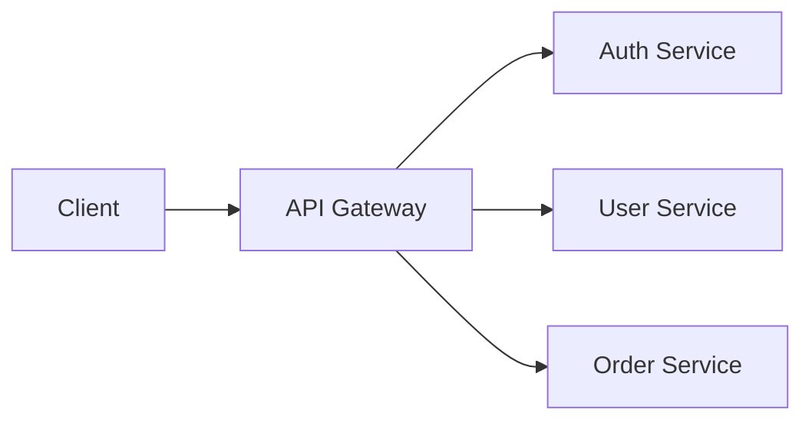

# Stoplight Documentation Skill

Write API documentation fully compatible with Stoplight platform: articles in Stoplight Flavored Markdown (SMD), OpenAPI specs, project structure with toc.json, and governance-aligned API descriptions.

## When This Skill Applies

- Writing API documentation articles (guides, tutorials, how-tos)
- Creating or editing OpenAPI 3.x specifications
- Structuring a Stoplight documentation project
- Reviewing API docs for Stoplight compatibility
- Applying API governance rules to documentation

## Documentation Types

Stoplight projects contain three types of content:

| Type | Format | Purpose |
|------|--------|---------|
| **API Reference** | OpenAPI 3.x (YAML/JSON) | Auto-rendered endpoint docs with Try It |
| **Articles** | Markdown (.md) with SMD extensions | Guides, tutorials, getting started |
| **Models/Schemas** | JSON Schema within OpenAPI | Reusable data models |

## Project Structure

```
project/
├── toc.json                    # Custom sidebar navigation
├── docs/
│   ├── getting-started.md      # Getting started guide (most important page)
│   ├── authentication.md       # Auth guide
│   ├── errors.md               # Error handling guide
│   ├── pagination.md           # Pagination guide
│   └── guides/
│       ├── quickstart.md
│       └── advanced-usage.md
├── reference/
│   ├── openapi.yaml            # Main API spec
│   └── models/
│       └── shared-schemas.yaml
└── assets/
    └── images/
```

## toc.json — Sidebar Navigation

```json
{
  "items": [
    {
      "type": "divider",
      "title": "Getting Started"
    },
    {
      "type": "item",
      "title": "Introduction",
      "uri": "docs/getting-started.md"
    },
    {
      "type": "item",
      "title": "Authentication",
      "uri": "docs/authentication.md"
    },
    {
      "type": "divider",
      "title": "API Reference"
    },
    {
      "type": "item",
      "title": "REST API",
      "uri": "reference/openapi.yaml"
    },
    {
      "type": "group",
      "title": "Guides",
      "items": [
        {
          "type": "item",
          "title": "Quickstart",
          "uri": "docs/guides/quickstart.md"
        },
        {
          "type": "item",
          "title": "Advanced Usage",
          "uri": "docs/guides/advanced-usage.md"
        }
      ]
    }
  ]
}
```

**toc.json item types:**
- `item` — link to a page (requires `title` + `uri`)
- `divider` — section heading separator (requires `title`)
- `group` — collapsible container with nested `items`

## Stoplight Flavored Markdown (SMD) — Complete Reference

SMD extends CommonMark with inline HTML comment annotations containing YAML values. Two core principles:
1. **Human readable** — raw source viewable/editable in any text editor
2. **Graceful degradation** — renders cleanly in GitHub, VS Code, and any CommonMark renderer

Annotation pattern: `<!-- key: value -->` placed on the line **before** the target element.

### Callouts

Blockquotes with a `theme` annotation. The annotation line must be immediately before the blockquote.

```markdown
<!-- theme: info -->
> **Note**
> This endpoint requires authentication.

<!-- theme: warning -->
> **Important**
> Rate limits apply to all requests.

<!-- theme: danger -->
> **Breaking Change**
> This endpoint is deprecated in v2.

<!-- theme: success -->
> **Tip**
> Use batch endpoints for better performance.
```

**Themes:** `info`, `success`, `warning`, `danger`

### Tabs

Tab blocks require a leading `type: tab` annotation for each tab page and a closing `type: tab-end` annotation.

```markdown
<!--
type: tab
title: cURL
-->

` ` `bash
curl -X GET https://api.example.com/users \
  -H "Authorization: Bearer TOKEN"
` ` `

<!--
type: tab
title: Python
-->

` ` `python
import requests

response = requests.get(
    "https://api.example.com/users",
    headers={"Authorization": "Bearer TOKEN"}
)
` ` `

<!-- type: tab-end -->
```

**Rules:**
- Each tab starts with `<!-- type: tab title: Tab Name -->`
- Content between tab annotations becomes that tab's page
- Close the entire tab block with `<!-- type: tab-end -->`
- Tabs can contain any markdown content (text, code, images, callouts)

### Code Blocks

#### With title annotation

```markdown
<!-- title: Create a new user -->
` ` `json
{
  "name": "John Doe",
  "email": "john@example.com"
}
` ` `
```

#### Annotation attributes

| Attribute | Type | Default | Description |
|-----------|------|---------|-------------|
| `title` | string | — | Title displayed above the code block |
| `lineNumbers` | boolean | true | Show/hide line numbers |

#### Meta string (alternative syntax)

Title can also be set via code fence meta string:

```markdown
` ` `json title="Create a new user" lineNumbers=false
{
  "name": "John Doe"
}
` ` `
```

#### Automatic tabbed code groups

Multiple consecutive code blocks (with no other content between them) automatically render as a tabbed group. The language tag becomes the tab label.

```markdown
` ` `bash
curl https://api.example.com/users
` ` `

` ` `python
requests.get("https://api.example.com/users")
` ` `

` ` `javascript
fetch("https://api.example.com/users")
` ` `
```

This renders as a single tabbed block with "bash", "python", "javascript" tabs — no `type: tab` annotations needed.

### Tables with Title

```markdown
<!-- title: HTTP Status Codes -->
| Code | Meaning |
|------|---------|
| 200  | Success |
| 400  | Bad Request |
| 401  | Unauthorized |
| 404  | Not Found |
```

### Images

Standard markdown images with optional SMD annotations for customization:

```markdown
<!-- focus: center -->


<!-- focus: top -->

```

#### Image annotation attributes

| Attribute | Values | Description |
|-----------|--------|-------------|
| `focus` | `center`, `top`, `false` | Controls image cropping/focus area |
| `bg` | CSS color value | Background color behind the image |

```markdown
<!-- focus: center, bg: #f5f5f5 -->

```

Set `focus: false` to display image at natural size without cropping.

### Diagrams (Mermaid)

Mermaid diagrams are supported natively inside code fences:

````markdown

````

Supported Mermaid diagram types:
- `graph` / `flowchart` — flowcharts
- `sequenceDiagram` — sequence diagrams
- `journey` — user journey maps
- `classDiagram`, `stateDiagram`, `erDiagram`
- `gantt`, `pie`

### JSON Schema Block

Code fence with `json` or `yaml` language tag plus `json_schema` secondary tag. Renders as an interactive, expandable schema viewer.

````markdown
```json json_schema
{
  "type": "object",
  "properties": {
    "id": { "type": "integer" },
    "name": { "type": "string" },
    "email": { "type": "string", "format": "email" }
  },
  "required": ["id", "name", "email"]
}
```
````

YAML variant:

````markdown
```yaml json_schema
type: object
properties:
  id:
    type: integer
  name:
    type: string
required:
  - id
  - name
```
````

### HTTP Request Maker (Try It)

Embed interactive HTTP requests that readers can execute directly. Code fence with `json` or `yaml` language tag plus `http` secondary tag.

````markdown
```json http
{
  "method": "POST",
  "url": "https://api.example.com/users",
  "headers": {
    "Content-Type": "application/json",
    "Authorization": "Bearer TOKEN"
  },
  "query": {
    "notify": "true"
  },
  "body": {
    "name": "John Doe",
    "email": "john@example.com"
  }
}
```
````

**HTTP Request Object fields:**

| Field | Type | Description |
|-------|------|-------------|
| `method` | string | HTTP method (GET, POST, PUT, PATCH, DELETE) |
| `url` | string | Full request URL |
| `headers` | object | Request headers |
| `query` | object | Query parameters |
| `body` | object/string | Request body |

### Task Lists

Standard CommonMark checkbox lists:

```markdown
- [x] Create OpenAPI spec
- [x] Write getting started guide
- [ ] Add authentication docs
- [ ] Review error handling
```

### Embeds

Links placed alone in their own paragraph auto-embed as rich content. Supported platforms:

| Platform | Example |
|----------|---------|
| YouTube | `https://www.youtube.com/watch?v=VIDEO_ID` |
| Vimeo | `https://vimeo.com/VIDEO_ID` |
| GitHub Gist | `https://gist.github.com/user/GIST_ID` |
| CodePen | `https://codepen.io/user/pen/PEN_ID` |
| CodeSandbox | `https://codesandbox.io/s/SANDBOX_ID` |
| Figma | `https://www.figma.com/file/FILE_ID` |
| Runkit | `https://runkit.com/user/NOTEBOOK_ID` |
| Replit | `https://replit.com/@user/REPL_NAME` |
| Twitter/X | `https://twitter.com/user/status/TWEET_ID` |
| Spotify | `https://open.spotify.com/track/TRACK_ID` |
| SpeakerDeck | `https://speakerdeck.com/user/DECK_NAME` |
| Slideshare | `https://www.slideshare.net/user/DECK_NAME` |

```markdown
Here's a demo video:

https://www.youtube.com/watch?v=abc123

And an interactive example:

https://codepen.io/user/pen/xyz789
```

The link must be the only content in its paragraph (blank lines before and after).

### HTML Support

Basic HTML elements are supported but markdown equivalents are preferred:

```markdown
<!-- Supported but prefer markdown -->
<table>, <tr>, <td>, <th>
<details>, <summary>
<br>, <hr>
<sup>, <sub>
<kbd>
```

### SMD Quick Reference Table

| Element | Annotation | Placement |
|---------|-----------|-----------|
| Callout | `<!-- theme: info\|success\|warning\|danger -->` | Before blockquote |
| Tab start | `<!-- type: tab title: Name -->` | Before tab content |
| Tab end | `<!-- type: tab-end -->` | After last tab |
| Code title | `<!-- title: "Title" -->` | Before code fence |
| Code options | `<!-- lineNumbers: false -->` | Before code fence |
| Table title | `<!-- title: "Title" -->` | Before table |
| Image focus | `<!-- focus: center\|top\|false -->` | Before image |
| Image bg | `<!-- bg: #hexcolor -->` | Before image (combine with focus) |
| JSON Schema | ` ```json json_schema ` | Code fence language tag |
| HTTP Try It | ` ```json http ` | Code fence language tag |
| Mermaid | ` ```mermaid ` | Code fence language tag |

## Article Writing Rules

### Structure every article with:

1. **Title** (H1) — clear, action-oriented
2. **Overview** — 1-2 sentences explaining what and why
3. **Prerequisites** (if needed) — what the reader needs before starting
4. **Step-by-step content** — numbered steps or clear sections
5. **Code examples** — with tabs for multiple languages when applicable
6. **Next steps** — links to related articles

### Writing style:

- Use second person ("you") to address the reader
- Lead with the most common use case
- Keep paragraphs short (2-4 sentences max)
- Use callouts for warnings, tips, and important notes
- Every code example must be copy-pasteable and runnable
- Follow Microsoft Writing Style Guide conventions

### Getting Started guide (most critical page):

- Must be the first article a new developer reads
- Include a "Hello World" example showing the API's core value
- Cover: get API key → make first request → see result
- Should take under 5 minutes to complete

## OpenAPI Specification Rules

When writing or reviewing OpenAPI specs, enforce these conventions:

### Naming

| Element | Convention | Example |
|---------|-----------|---------|
| Paths | kebab-case, plural nouns | `/user-accounts`, `/order-items` |
| Path params | camelCase | `{userId}`, `{orderId}` |
| Query params | camelCase | `sortOrder`, `pageSize` |
| Schema names | PascalCase | `UserAccount`, `OrderItem` |
| Properties | camelCase | `firstName`, `createdAt` |

### Path rules

- Always HTTPS (except localhost)
- No trailing slashes
- No file extensions (`.json`, `.xml`)
- No HTTP verbs in paths (`/getUsers` → `/users`)
- No special characters (`%20`, `&`, `+`)
- Define path params at path level, not operation level
- Include `/status` or `/health` endpoint

### Required fields for every endpoint

```yaml
paths:
  /users:
    get:
      summary: List all users          # Short, imperative
      description: |                    # Detailed explanation
        Returns a paginated list of users.
        Results are sorted by creation date.
      operationId: listUsers            # Unique, camelCase
      tags:
        - Users                         # Group in sidebar
      parameters: []
      responses:
        '200':
          description: Successful response
          content:
            application/json:
              schema:
                $ref: '#/components/schemas/UserList'
              examples:
                default:
                  $ref: '#/components/examples/UserListExample'
        '401':
          $ref: '#/components/responses/Unauthorized'
```

### Every OpenAPI spec must include

- `info.title`, `info.description`, `info.version`
- `servers` with at least production URL
- `security` schemes defined in `components/securitySchemes`
- `tags` with descriptions for sidebar grouping
- Reusable `components`: schemas, responses, parameters, examples
- Error response schemas (400, 401, 403, 404, 500)

### Versioning

- Include only major version: `v1`, `v2`
- Choose one strategy (URL-level or header-based) and be consistent
- Document breaking changes in a changelog article

### Security schemes

```yaml
components:
  securitySchemes:
    BearerAuth:
      type: http
      scheme: bearer
      bearerFormat: JWT
    ApiKeyAuth:
      type: apiKey
      in: header
      name: X-API-Key
```

### Error response format (standardize across all endpoints)

```yaml
components:
  schemas:
    Error:
      type: object
      required: [code, message]
      properties:
        code:
          type: string
          description: Machine-readable error code
          example: "VALIDATION_ERROR"
        message:
          type: string
          description: Human-readable error message
          example: "Email field is required"
        details:
          type: array
          items:
            type: object
            properties:
              field:
                type: string
              reason:
                type: string
```

## Workflow

When asked to write Stoplight-compatible documentation:

1. **Determine content type** — article (MD), API reference (OpenAPI), or both
2. **For articles:**
   - Use SMD syntax (callouts, tabs, code blocks, HTTP request maker)
   - Follow the article structure rules above
   - Reference OpenAPI endpoints with links, not duplication
3. **For OpenAPI specs:**
   - Follow all naming and path conventions
   - Include complete examples for every endpoint
   - Use `$ref` for reusable components
   - Add `tags` for sidebar organization
4. **For project structure:**
   - Create toc.json for custom navigation
   - Organize files: docs/ for articles, reference/ for specs
   - Getting Started guide is always the first page
5. **Review checklist:**
   - [ ] All paths use kebab-case plural nouns
   - [ ] All params use camelCase
   - [ ] Every endpoint has summary, description, operationId, tags
   - [ ] Error responses are standardized
   - [ ] Security schemes are defined
   - [ ] Articles use SMD callouts (not bold text) for warnings/tips
   - [ ] Multi-language code examples use tabs or consecutive code blocks
   - [ ] Images have `focus` annotations where needed
   - [ ] Diagrams use Mermaid code blocks (not external images)
   - [ ] Interactive examples use HTTP Request Maker blocks
   - [ ] Schemas in articles use `json_schema` blocks (not plain JSON)
   - [ ] Embeds (YouTube, Gist) are standalone links in own paragraph
   - [ ] Code examples are copy-pasteable and runnable
   - [ ] Getting Started guide exists and takes < 5 min
