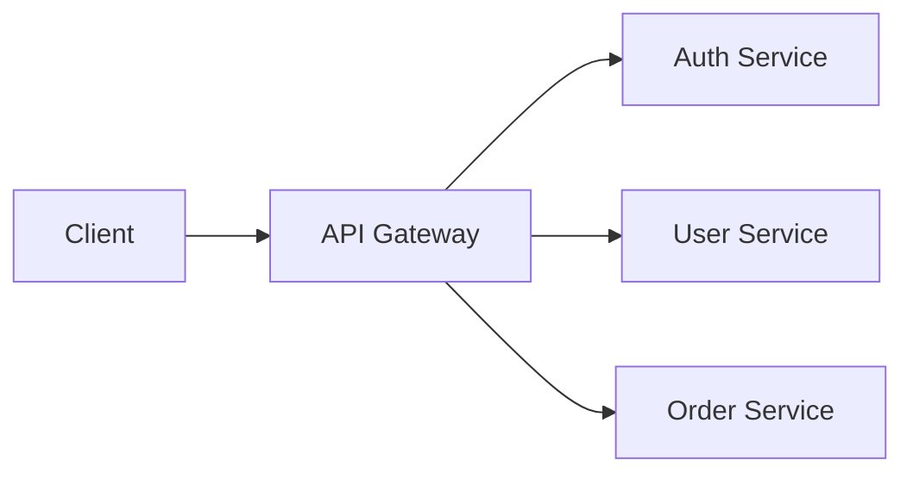
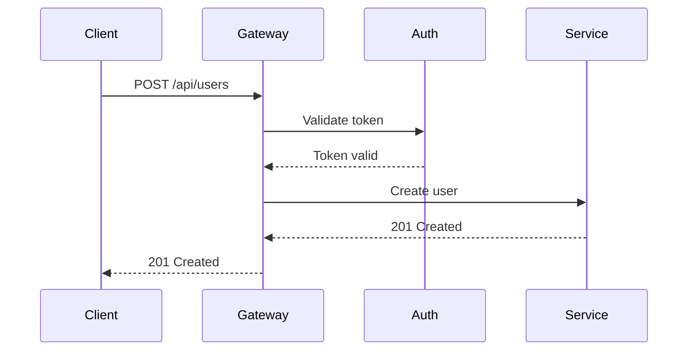

# Stoplight Flavored Markdown (SMD) — Syntax Reference

Complete syntax reference for all SMD elements. Use as a quick lookup when writing Stoplight-compatible documentation.

Source: [Stoplight SMD Documentation](https://docs.stoplight.io/docs/platform/b591e6d161539-stoplight-flavored-markdown-smd)

## Principles

1. **Human readable** — raw Markdown viewable in any editor
2. **Graceful degradation** — annotations use HTML comments, invisible in standard renderers (GitHub, VS Code)
3. **CommonMark compatible** — all standard Markdown works as expected

## Annotation Pattern

All SMD annotations use HTML comments with YAML values, placed on the line **immediately before** the target element:

```
<!-- key: value -->
[markdown element here]
```

Multiple attributes can be combined:

```
<!-- key1: value1, key2: value2 -->
```

Or as multi-line YAML:

```
<!--
key1: value1
key2: value2
-->
```

---

## Callouts

Blockquote with `theme` annotation.

### Syntax

```markdown
<!-- theme: info -->
> **Title**
> Body text of the callout.
```

### Themes

| Theme | Use for |
|-------|---------|
| `info` | General notes, FYI |
| `success` | Tips, best practices, positive outcomes |
| `warning` | Cautions, important prerequisites |
| `danger` | Breaking changes, security warnings, destructive actions |

### Examples

```markdown
<!-- theme: info -->
> **Authentication Required**
> All endpoints require a valid Bearer token in the Authorization header.

<!-- theme: warning -->
> **Rate Limiting**
> This endpoint is limited to 100 requests per minute. Exceeding the limit returns `429 Too Many Requests`.

<!-- theme: danger -->
> **Deprecated**
> This endpoint will be removed in v3. Migrate to `/v2/users` before January 2025.

<!-- theme: success -->
> **Pro Tip**
> Use the `fields` query parameter to request only the data you need, reducing response size by up to 80%.
```

---

## Tabs

### Syntax

```markdown
<!--
type: tab
title: First Tab
-->

Content of the first tab.

<!--
type: tab
title: Second Tab
-->

Content of the second tab.

<!-- type: tab-end -->
```

### Rules

- Each tab: `<!-- type: tab title: Tab Name -->`
- Close block: `<!-- type: tab-end -->`
- Tabs can contain any markdown: text, code blocks, images, callouts, tables
- No limit on number of tabs (but keep it practical: 2-5)

### Common Use Cases

**Multi-language code examples:**

```markdown
<!--
type: tab
title: cURL
-->

` ` `bash
curl -X POST https://api.example.com/users \
  -H "Content-Type: application/json" \
  -H "Authorization: Bearer TOKEN" \
  -d '{"name": "John"}'
` ` `

<!--
type: tab
title: Python
-->

` ` `python
import requests

response = requests.post(
    "https://api.example.com/users",
    headers={"Authorization": "Bearer TOKEN"},
    json={"name": "John"}
)
` ` `

<!--
type: tab
title: JavaScript
-->

` ` `javascript
const response = await fetch("https://api.example.com/users", {
  method: "POST",
  headers: {
    "Content-Type": "application/json",
    "Authorization": "Bearer TOKEN"
  },
  body: JSON.stringify({ name: "John" })
});
` ` `

<!-- type: tab-end -->
```

---

## Code Blocks

### With annotation

```markdown
<!-- title: Example response -->
` ` `json
{
  "id": 1,
  "name": "John Doe"
}
` ` `
```

### With meta string

```markdown
` ` `json title="Example response" lineNumbers=false
{
  "id": 1,
  "name": "John Doe"
}
` ` `
```

### Attributes

| Attribute | Type | Default | Description |
|-----------|------|---------|-------------|
| `title` | string | — | Title displayed above code block |
| `lineNumbers` | boolean | `true` | Show or hide line numbers |

### Automatic tabbed code groups

Multiple consecutive code blocks (no content between them) automatically render as a tabbed group. The language tag becomes the tab label:

```markdown
` ` `bash
curl https://api.example.com/users
` ` `

` ` `python
requests.get("https://api.example.com/users")
` ` `

` ` `javascript
fetch("https://api.example.com/users")
` ` `
```

This renders as tabs labeled "bash", "python", "javascript" — no `type: tab` annotations needed. Use this shorthand for simple multi-language code snippets.

---

## Tables

### With title annotation

```markdown
<!-- title: Supported Authentication Methods -->
| Method | Header | Format |
|--------|--------|--------|
| Bearer Token | `Authorization` | `Bearer <token>` |
| API Key | `X-API-Key` | `<api-key>` |
```

---

## Images

### Basic

```markdown

```

### With focus annotation

```markdown
<!-- focus: center -->

```

### Attributes

| Attribute | Values | Description |
|-----------|--------|-------------|
| `focus` | `center` | Crop to center (default for large images) |
| `focus` | `top` | Crop focusing on top portion |
| `focus` | `false` | Display at natural size, no cropping |
| `bg` | CSS color | Background color behind image |

### Combined attributes

```markdown
<!-- focus: center, bg: #f8f9fa -->


<!-- focus: false, bg: #1a1a2e -->

```

---

## Mermaid Diagrams

Native support for Mermaid diagram syntax inside code fences:

````markdown

````

### Supported diagram types

| Type | Keyword |
|------|---------|
| Flowchart | `graph` or `flowchart` |
| Sequence diagram | `sequenceDiagram` |
| Class diagram | `classDiagram` |
| State diagram | `stateDiagram-v2` |
| Entity relationship | `erDiagram` |
| User journey | `journey` |
| Gantt chart | `gantt` |
| Pie chart | `pie` |

### Example: Sequence Diagram

````markdown

````

---

## JSON Schema Block

Renders as an interactive, expandable schema viewer. Uses `json_schema` as secondary language tag.

````markdown
```json json_schema
{
  "title": "User",
  "type": "object",
  "properties": {
    "id": {
      "type": "integer",
      "description": "Unique identifier",
      "readOnly": true
    },
    "name": {
      "type": "string",
      "description": "Full name",
      "minLength": 1,
      "maxLength": 255
    },
    "email": {
      "type": "string",
      "format": "email",
      "description": "Email address"
    },
    "role": {
      "type": "string",
      "enum": ["admin", "user", "viewer"],
      "default": "user"
    }
  },
  "required": ["name", "email"]
}
```
````

YAML variant:

````markdown
```yaml json_schema
title: User
type: object
properties:
  id:
    type: integer
    description: Unique identifier
    readOnly: true
  name:
    type: string
    minLength: 1
  email:
    type: string
    format: email
required:
  - name
  - email
```
````

---

## HTTP Request Maker (Try It)

Embeds an interactive HTTP request that readers can execute. Uses `http` as secondary language tag.

````markdown
```json http
{
  "method": "POST",
  "url": "https://api.example.com/users",
  "headers": {
    "Content-Type": "application/json",
    "Authorization": "Bearer YOUR_TOKEN"
  },
  "query": {
    "notify": "true"
  },
  "body": {
    "name": "John Doe",
    "email": "john@example.com",
    "role": "user"
  }
}
```
````

### HTTP Request Object

| Field | Type | Required | Description |
|-------|------|----------|-------------|
| `method` | string | yes | HTTP method: GET, POST, PUT, PATCH, DELETE |
| `url` | string | yes | Full request URL |
| `headers` | object | no | Key-value pairs for request headers |
| `query` | object | no | Key-value pairs for query parameters |
| `body` | object/string | no | Request body (JSON or string) |

### GET example

````markdown
```json http
{
  "method": "GET",
  "url": "https://api.example.com/users",
  "headers": {
    "Authorization": "Bearer YOUR_TOKEN"
  },
  "query": {
    "page": "1",
    "pageSize": "20",
    "sortBy": "createdAt"
  }
}
```
````

---

## Task Lists

```markdown
- [x] Create OpenAPI spec
- [x] Write getting started guide
- [ ] Add authentication docs
- [ ] Review error handling
```

---

## Embeds

Links placed **alone in their own paragraph** (blank lines before and after) auto-render as rich embedded content.

```markdown
Here's a walkthrough video:

https://www.youtube.com/watch?v=abc123

Check out this live example:

https://codepen.io/user/pen/xyz789
```

### Supported platforms

YouTube, Vimeo, GitHub Gist, CodePen, CodeSandbox, Figma, Runkit, Replit, Twitter/X, Spotify, SpeakerDeck, Slideshare

### Rules

- Link must be the **only content** in its paragraph
- Blank line before and after the link
- No additional text on the same line
- Standard markdown links `[text](url)` will NOT auto-embed

---

## HTML Support

Basic HTML elements work but markdown equivalents are preferred:

| HTML | When to use |
|------|-------------|
| `<details>` / `<summary>` | Collapsible sections |
| `<sup>` / `<sub>` | Superscript/subscript |
| `<kbd>` | Keyboard shortcuts |
| `<br>` | Force line break |
| `<table>` | Complex tables with colspan/rowspan |

```markdown
<details>
<summary>Click to expand advanced configuration</summary>

Set the `ADVANCED_MODE` environment variable:

` ` `bash
export ADVANCED_MODE=true
` ` `

</details>
```
